# Scribe AI Voice & Chat Assistant Platform — Complete Master Architecture & Flow Specification

This document provides an exhaustive, end-to-end technical specification and visual flow diagrams covering **every subsystem, lifecycle, data pipeline, security layer, and API route** in the application.

---

## Table of Contents
1. [High-Level System Topology](#1-high-level-system-topology)
2. [Dual-Mode Architecture Overview (Personal vs Business)](#2-dual-mode-architecture-overview-personal-vs-business)
3. [Personal Mode Architecture (3-Pane RAG & Voice Studio)](#3-personal-mode-architecture-3-pane-rag--voice-studio)
   - 3.1 [Pane 1: Knowledge Base & Document Ingestion](#31-pane-1-knowledge-base--document-ingestion)
   - 3.2 [Pane 2: Interactive Chat Studio & Multi-Modal Composer](#32-pane-2-interactive-chat-studio--multi-modal-composer)
   - 3.3 [Pane 3: Source Inspector & In-Line Citations](#33-pane-3-source-inspector--in-line-citations)
   - 3.4 [Embedded Real-Time Voice Call Modal](#34-embedded-real-time-voice-call-modal)
   - 3.5 [Request & Latency Tracking Pipeline](#35-request--latency-tracking-pipeline)
4. [Business Owner Console Lifecycle & Subsystems](#4-business-owner-console-lifecycle--subsystems)
   - 4.1 [Zero-Flicker Workspace Cache & SWR Navigation](#41-zero-flicker-workspace-cache--swr-navigation)
   - 4.2 [Overview Dashboard & Metrics Pipeline](#42-overview-dashboard--metrics-pipeline)
   - 4.3 [Assistant Studio & Dual-Channel Prompt Engine](#43-assistant-studio--dual-channel-prompt-engine)
   - 4.4 [People, Calls & Token Lifecycle Subsystem](#44-people-calls--token-lifecycle-subsystem)
   - 4.5 [Account, Encryption & API Vault](#45-account-encryption--api-vault)
5. [Customer / Caller Interaction Flows](#5-customer--caller-interaction-flows)
   - 5.1 [Public Directory & Smart Caller Deduplication](#51-public-directory--smart-caller-deduplication)
   - 5.2 [Dedicated Token Link & Device Binding Security](#52-dedicated-token-link--device-binding-security)
6. [Real-Time Bidirectional Voice Call Pipeline](#6-real-time-bidirectional-voice-call-pipeline)
7. [Text Chat & RAG Document Grounding Engine](#7-text-chat--rag-document-grounding-engine)
8. [Complete Database Schema & Entity-Relationship Model (ERD)](#8-complete-database-schema--entity-relationship-model-erd)
9. [Comprehensive Backend API Route Directory](#9-comprehensive-backend-api-route-directory)

---

## 2. Dual-Mode Architecture Overview (Personal vs Business)

The platform supports two distinct operational modes determined by the owner's selection in `/setup` and resolved by identity headers (`X-User-Groq-Key`, `X-User-Sarvam-Key`, `X-Client-Id` or session cookie):

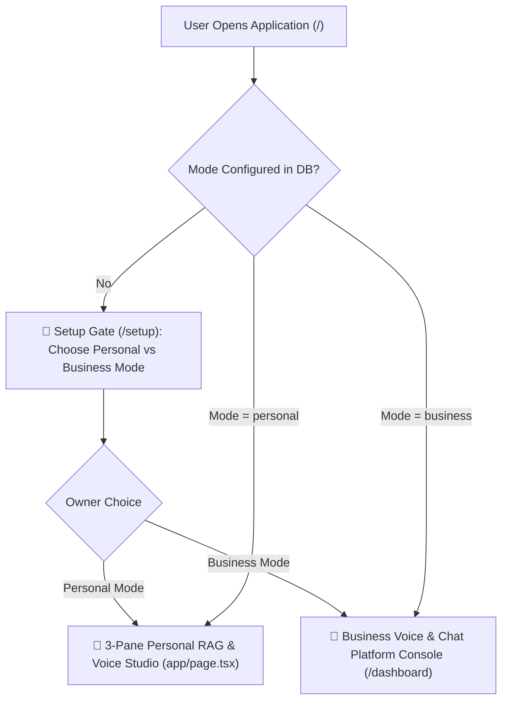

---

## 3. Personal Mode Architecture (3-Pane RAG & Voice Studio)

In Personal Mode (`app/page.tsx`), the application presents a sleek, manuscript-toned 3-pane interface designed for intensive document research, multi-modal chat, source verification, and real-time voice conversations.

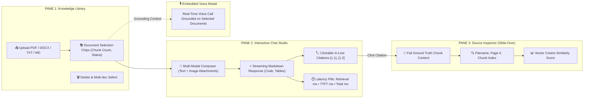

### 3.1 Pane 1: Knowledge Base & Document Ingestion
- **Document Uploader**: Ingests files up to 10MB per document (PDF, DOCX, TXT, Markdown).
- **Processing**: Automatically parses text, chunks into overlapping token segments (500 tokens with 50-token overlap), generates vector embeddings, and stores in the local vector index.
- **Selection Chips**: Allows the user to toggle which specific documents to ground their queries against.

### 3.2 Pane 2: Interactive Chat Studio & Multi-Modal Composer
- **Multi-modal Composer**: Accepts text prompts and attached images.
- **In-Line Citations**: Displays clickable citation badges (e.g. `[1.1]`, `[1.2]`) indicating the exact source document and chunk that grounded each assertion.
- **Real-Time Latency Metrics**: Displays detailed timing for transparency:
  - `retrieval_ms`: Vector similarity search latency.
  - `ttft_ms`: Time to first token from Groq LPU.
  - `total_ms`: Total end-to-end response generation time.

### 3.3 Pane 3: Source Inspector & In-Line Citations
- Clicking any citation badge smoothly expands the right-hand slide-over drawer to inspect the exact paragraph, page number, and vector cosine similarity score.

### 3.4 Embedded Real-Time Voice Call Modal
- The floating phone button launches an audio session where the user can speak directly with their documents via Sarvam STT, Groq RAG generation, and Sarvam TTS.

### 3.5 Request & Latency Tracking Pipeline
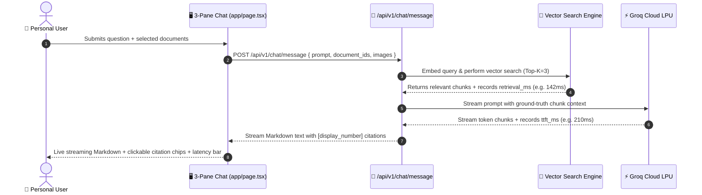

---

---

## 1. High-Level System Topology

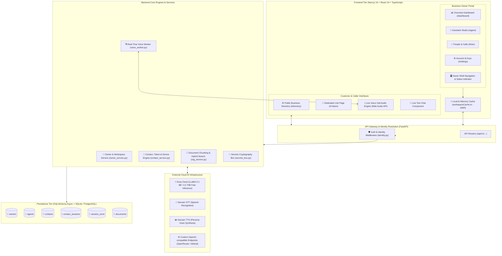

---

## 2. Business Owner Console Lifecycle & Subsystems

### 2.1 Zero-Flicker Workspace Cache & SWR Navigation
The console uses a persistent in-memory singleton coupled with `localStorage` caching to guarantee **0ms immediate UI rendering** when switching screens, eliminating loading stutters and branding flashes.

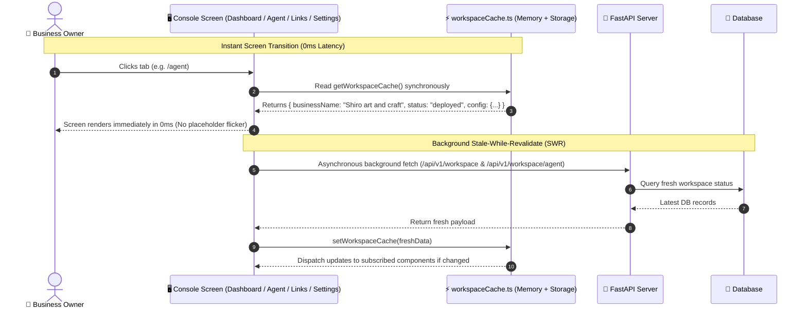

---

### 2.2 Overview Dashboard & Metrics Pipeline
Aggregates total completed talks, voice calls vs text chats, unique callers, and presents paginated dialogue sessions with slide-over transcript inspection.

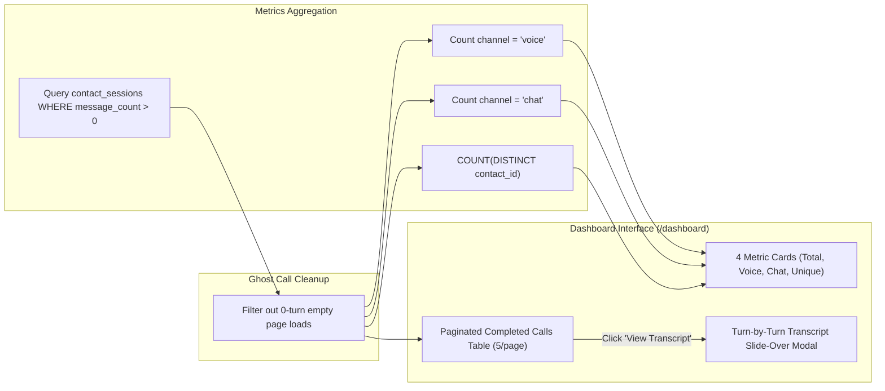

---

### 2.3 Assistant Studio & Dual-Channel Prompt Engine
Allows the owner to customize independent conversational prompts for spoken voice calls vs text chat, select TTS voice personas with audio preview, configure multilingual support, and connect custom LLM providers.

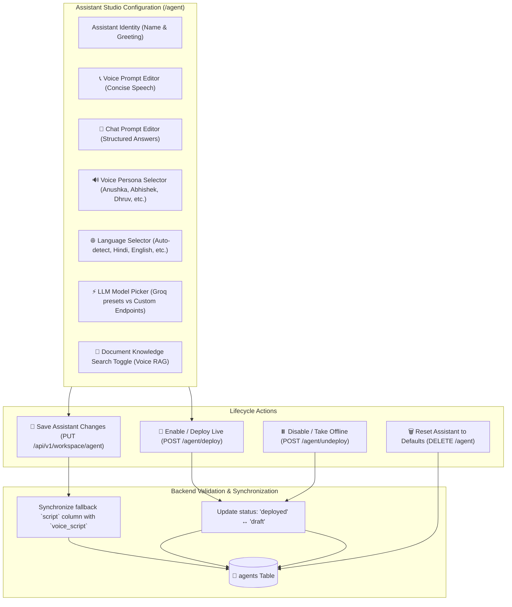

---

### 2.4 People, Calls & Token Lifecycle Subsystem
Manages customer access links, security PINs, device hardware locks, token rotation, and multi-drawer session inspections.

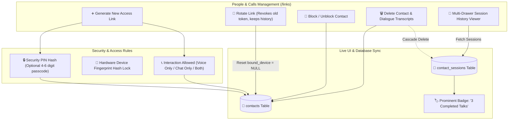

---

### 2.5 Account, Encryption & API Vault
Stores business metadata and securely encrypts external provider API keys using authenticated symmetric encryption.

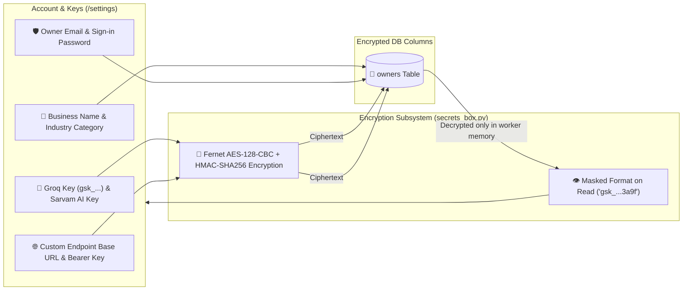

---

## 3. Customer / Caller Interaction Flows

### 3.1 Public Directory & Smart Caller Deduplication
Allows prospective customers to discover businesses and connect instantly without creating duplicate contacts if they return.

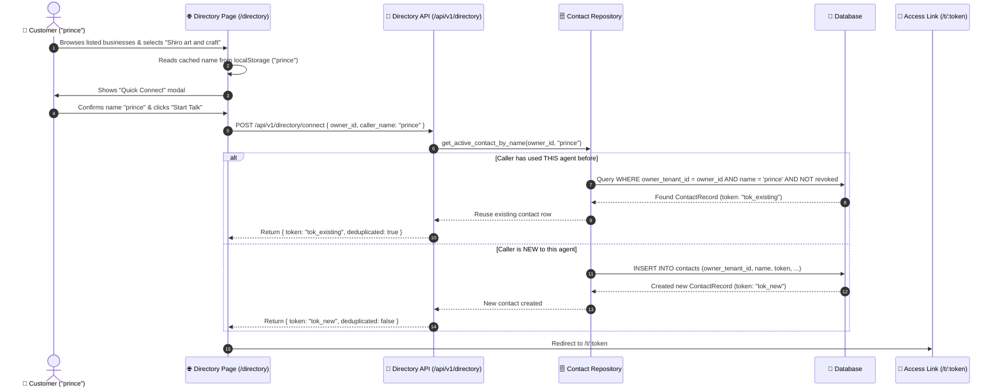

---

### 3.2 Dedicated Token Link & Device Binding Security
Validates security tokens, unlocks PIN gates, enforces hardware device fingerprint binding, and initiates the conversational session.

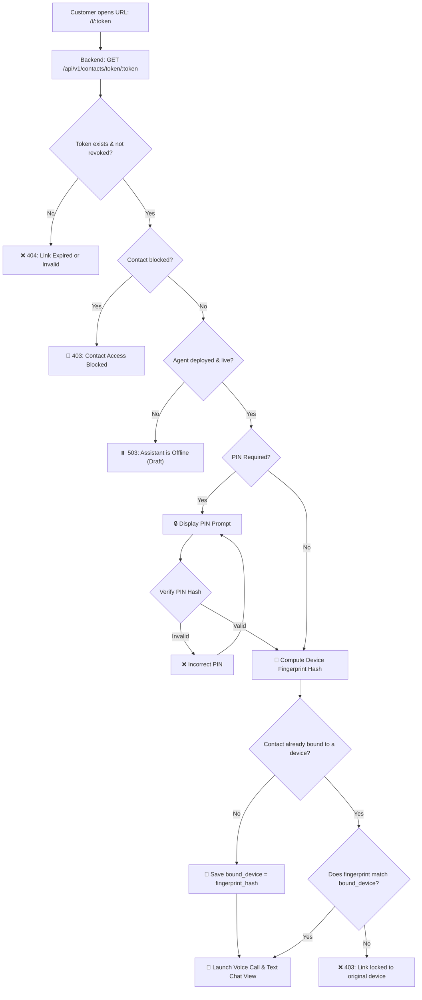

---

## 4. Real-Time Bidirectional Voice Call Pipeline

The high-performance voice pipeline streams audio bi-directionally over WebSockets, performing voice activity detection, streaming transcription, temporal grounding, RAG injection, fast LLM inference, and voice synthesis.

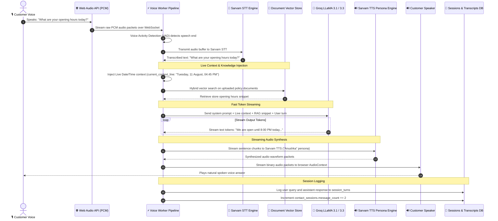

---

## 5. Text Chat & RAG Document Grounding Engine

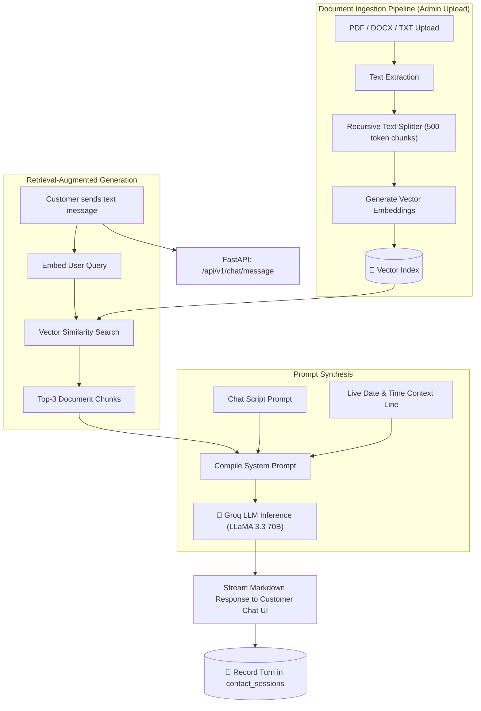

---

## 6. Complete Database Schema & Entity-Relationship Model (ERD)

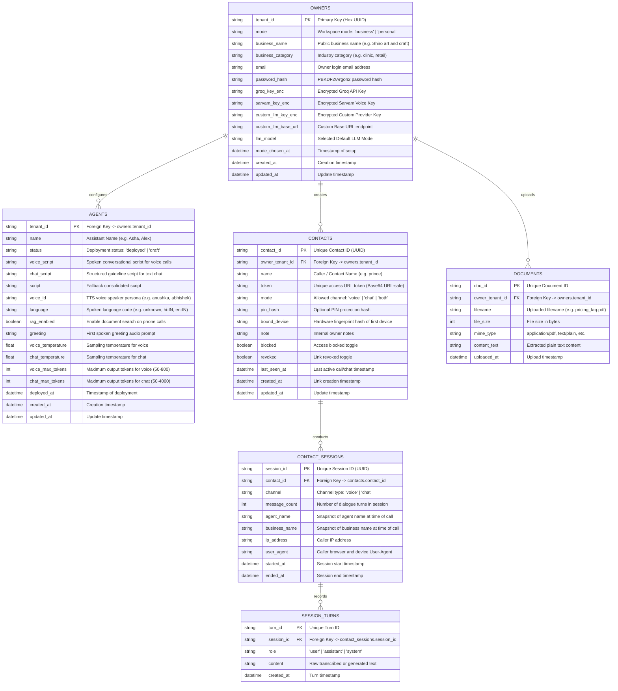

---

## 7. Comprehensive Backend API Route Directory

### 🏢 Workspace & Owner Routes (`/api/v1/workspace`)
| Method | Endpoint | Description | Auth Required |
| :--- | :--- | :--- | :--- |
| `GET` | `/api/v1/workspace` | Retrieve active workspace profile, business name, and mode | Owner Cookie / Key |
| `POST` | `/api/v1/workspace/mode` | Set workspace mode (`business` vs `personal`) & business name | Owner Cookie / Key |
| `PUT` | `/api/v1/workspace/profile` | Update business name and business category | Owner Cookie / Key |
| `GET` | `/api/v1/workspace/providers` | Retrieve encrypted API key status and default LLM model | Owner Cookie / Key |
| `PUT` | `/api/v1/workspace/providers` | Encrypt and save Groq, Sarvam, and Custom Provider keys | Owner Cookie / Key |
| `POST` | `/api/v1/workspace/credentials` | Update owner login email and set console password | Owner Cookie / Key |
| `GET` | `/api/v1/workspace/categories` | List available business category presets | Public / Owner |
| `GET` | `/api/v1/workspace/agent` | Retrieve assistant configuration, prompts, and voice | Owner Cookie / Key |
| `PUT` | `/api/v1/workspace/agent` | Update assistant voice/chat scripts, model, and persona | Owner Cookie / Key |
| `POST` | `/api/v1/workspace/agent/deploy` | Make assistant **Live** (enables calls from directory and links) | Owner Cookie / Key |
| `POST` | `/api/v1/workspace/agent/undeploy` | Take assistant **Offline (Draft)** | Owner Cookie / Key |
| `DELETE`| `/api/v1/workspace/agent` | Reset assistant prompts and voice back to fresh defaults | Owner Cookie / Key |
| `GET` | `/api/v1/workspace/channels` | Check readiness of Voice and Chat channels | Owner Cookie / Key |
| `POST` | `/api/v1/workspace/logout` | Clear owner session cookie and sign out | Owner Cookie |

---

### 👥 Contacts & Calls Routes (`/api/v1/contacts`)
| Method | Endpoint | Description | Auth Required |
| :--- | :--- | :--- | :--- |
| `GET` | `/api/v1/contacts` | List all unique contacts with session counts and device status | Owner Cookie / Key |
| `POST` | `/api/v1/contacts` | Generate a new access link with name, PIN, and allowed mode | Owner Cookie / Key |
| `GET` | `/api/v1/contacts/overview` | Dashboard metrics totals and recent completed conversations | Owner Cookie / Key |
| `POST` | `/api/v1/contacts/:id/rotate` | Revoke old token and issue fresh token (resets device binding) | Owner Cookie / Key |
| `POST` | `/api/v1/contacts/:id/block` | Block or unblock caller access | Owner Cookie / Key |
| `DELETE`| `/api/v1/contacts/:id` | Delete contact profile and all associated call transcripts | Owner Cookie / Key |
| `GET` | `/api/v1/contacts/:id/sessions` | List all completed conversation sessions for a specific caller | Owner Cookie / Key |
| `GET` | `/api/v1/contacts/:id/transcript`| Retrieve full turn-by-turn dialogue transcript for a session | Owner Cookie / Key |
| `GET` | `/api/v1/contacts/token/:token` | Validate access link, check PIN, and bind device fingerprint | Caller Token |

---

### 🌐 Public Directory Routes (`/api/v1/directory`)
| Method | Endpoint | Description | Auth Required |
| :--- | :--- | :--- | :--- |
| `GET` | `/api/v1/directory` | List all public businesses with live deployed assistants | Public |
| `POST` | `/api/v1/directory/connect` | Smart connect: reuses existing contact for caller or creates new | Public |

---

### 🎙️ Voice & Document Routes (`/api/v1/voice`, `/api/v1/documents`)
| Method | Endpoint | Description | Auth Required |
| :--- | :--- | :--- | :--- |
| `GET` | `/api/v1/voice/speakers` | Catalogue of Sarvam voice personas (male & female) | Public / Owner |
| `GET` | `/api/v1/voice/languages`| List of supported languages for speech recognition & TTS | Public / Owner |
| `POST` | `/api/v1/voice/preview` | Generate instant audio sample for a speaker persona | Owner Cookie / Key |
| `WS` | `/api/v1/voice/stream` | Real-time bidirectional WebSocket audio streaming pipeline | Caller / Token |
| `GET` | `/api/v1/documents` | List uploaded RAG knowledge documents | Owner Cookie / Key |
| `POST` | `/api/v1/documents` | Upload and chunk PDF/DOCX/TXT knowledge file | Owner Cookie / Key |
| `DELETE`| `/api/v1/documents/:id` | Remove document from RAG index | Owner Cookie / Key |
