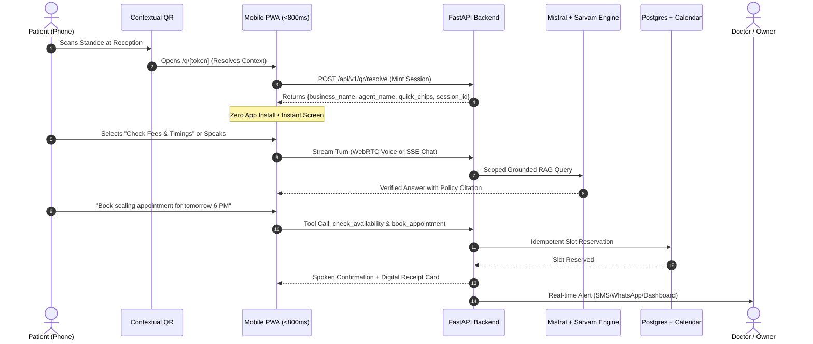
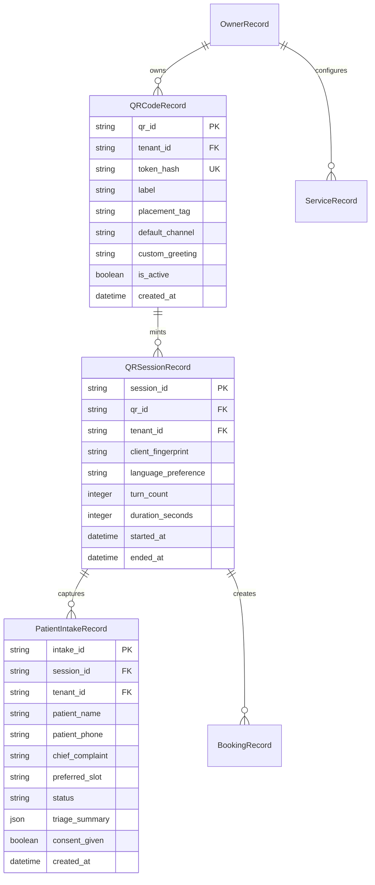

# BUSINESS QR MARKET RESEARCH, TECHNICAL DUE-DILIGENCE & STAGE-ONE PRODUCTION PLAN

**Document Version:** 1.0.0  
**Date:** 2026-09-08  
**Workspace:** `D:\work\New folder`  
**Author:** Senior Startup Strategist, AI Product Architect, Voice-Quality Engineer, UX Researcher & Due-Diligence Reviewer  
**Status:** Pre-Implementation Architectural Plan & Market Assessment (Awaiting Founder Approval)  
**Coordination Boundary:** Exclusively covers **Business QR**. Preserves and does not touch or duplicate `QR_AI_PRODUCT_STAGE1_PLAN.md` (Product QR).

---

## Direct Answers to Founder's Critical Questions

* **Is Business QR commercially promising or mostly a gimmick?**  
  **A generic "Scan to chat with our AI" QR code is 100% a dead gimmick.** Consumers ignore generic QRs because curiosity does not overcome friction, camera anxiety, or spam paranoia. However, an **Intent-Specific Contextual QR** placed at a physical bottleneck that solves a high-friction offline task (e.g., *"Scan for Immediate Doctor Appointment & Fee Schedule while reception is crowded"* or *"Scan to check walk-in availability & join digital queue"*) is commercially viable. The difference between a gimmick and a business is whether the QR promises a generic chat conversation or a concrete, friction-eliminating transaction.

* **Which business should use it first?**  
  **Owner-operated outpatient healthcare clinics and diagnostic centers** (dental, dermatology, pediatrics, physiotherapy, eye clinics) in Tier-1/Tier-2 urban clusters (e.g., Delhi NCR, Bengaluru, Mumbai, Pune). Secondarily, **high-ticket appointment-based aesthetic/wellness studios** (premium salons, trichology, physiotherapy). Clinics suffer from the "reception bottleneck": physical desk chaos during peak hours (5 PM–9 PM), 35–45% missed inbound phone calls, walk-in inquiries asking repetitive fee/schedule questions, and language friction between receptionists and patients speaking Hindi, English, or colloquial Hinglish.

* **Why would a customer scan it instead of calling, searching Google, or opening WhatsApp?**  
  1. **Vs Calling:** The physical reception phone is busy, unanswered, or ringing off the hook; physical walk-ins are standing in line; people hate waiting on hold.  
  2. **Vs Google:** Google Maps/Search shows stale opening hours, conflicting phone numbers, zero live slot availability, and no actual booking confirmation.  
  3. **Vs WhatsApp:** Unofficial WhatsApp numbers require manually saving a contact to phone storage (+91...), waiting 5–30 minutes for a human staffer to reply, or navigating clunky numerical menu trees ("Press 1 for hours, Press 2 for doctor"). A browser WebRTC QR opens in **under 800ms**, requires **no app install**, **no contact saving**, and allows immediate natural Hindi/Hinglish voice or text interaction.

* **What useful task will be completed?**  
  A complete end-to-end outcome:  
  1. Instant answers to specific doctor availability, consultation fees, procedure policies, and insurance/cashless status grounded in verified clinic knowledge.  
  2. Live appointment slot selection and booking directly into the clinic's calendar.  
  3. Structured patient intake (chief complaint, preferred timing, patient name, phone number) with explicit opt-in consent.  
  4. Real-time instant notification dispatched to the doctor/clinic manager (via WhatsApp/SMS/dashboard) with a structured summary and action item.

* **Why would the business pay?**  
  **Direct revenue recovery and front-desk decompression.** An urban Indian clinic loses 10 to 25 patients a week due to unanswered calls and walk-in queue abandonment. Each consultation is worth ₹600–₹1,500 in consultation fees and ₹2,000–₹15,000 in downstream procedures/tests. Recovering just 3–5 lost bookings per month yields ₹5,000–₹15,000 in net recovered revenue. A flat software subscription of ₹1,999 to ₹3,499/month delivers a measurable 3x–6x ROI within the first 14 days.

* **How much of the current system is reusable?**  
  **Approximately 72% of the existing codebase is reusable with zero or moderate adaptation.** The existing LiveKit WebRTC pipeline, Sarvam `saaras:v3` STT and `bulbul:v3` TTS integration, Mistral LLM streaming, hybrid dense/sparse Qdrant retrieval, calendar availability algorithms, SQLite/PostgreSQL schema, and contact/call-session telemetry are already working. The primary missing layers are: (1) Contextual QR campaign/location routing, (2) Anonymous visitor token minting without device lockouts, (3) Lead/intake state-machine logic, and (4) Owner alerting via webhooks/WhatsApp.

* **What must be fixed before any pilot?**  
  1. **CRITICAL DEFECT: Single-Device Contact Lockout.** `backend/app/api/contact_routes.py:431` and `backend/app/models/db_models.py:119` permanently bind a contact token to the first device that opens it (`bound_device`). If printed on a physical QR, Customer #1 scans it, and Customer #2 is blocked with `"This link is already in use on another device"`. Public QRs must mint ephemeral visitor sessions.  
  2. **Live credentials committed in repository:** `backend/.env:2` contains plaintext production keys for Groq, Qdrant, Sarvam, LiveKit, and Mistral. Must be rotated and git-purged immediately.  
  3. **Durability trap:** `docker-compose.yml:46` hardcodes `DATABASE_URL=sqlite+aiosqlite:///./data/rag.db`, silently overriding PostgreSQL settings and risking catastrophic data loss upon container volume deletion.  
  4. **Disabled safety guardrails:** `backend/.env:72` sets `LIMITS_ENABLED=false`, disabling all call duration caps, token ceilings, and spend guardrails.

* **What is the cheapest credible path to production?**  
  A **Zero-Fixed-Cost Stack** leveraging existing free tiers: Vercel/Cloudflare Pages for Next.js frontend, Supabase Free Tier for managed PostgreSQL and private file storage, Qdrant Cloud Free Tier (1GB cluster), LiveKit Cloud Free Tier (50 audio hours/month, 10 concurrent connections), Sarvam AI API for Indic voice (~₹0.40–₹0.60 per voice minute), and Mistral Small API (~$0.10/M tokens). Total hosting cost during Stage-One pilot: **₹0/month fixed infrastructure** + **~₹1.80 per completed voice intake interaction**.

* **What is the largest unresolved risk?**  
  **Physical QR scan inertia and staff misalignment.** If the clinic receptionist views the QR code standee as a threat to their job or fails to point frustrated walk-ins to it, patients will ignore it. Distribution cannot rely on passive poster placement; it requires a physical point-of-sale standee with a hyper-specific, urgent value proposition (*"Doctor running 20 mins late? Scan to check live queue status & book next slot"*) and front-desk staff incentivized to deflect repetitive questions.

---

## 1. Executive Decision (One-Page Brief)

### 1.1 Strategy Summary
The Business QR opportunity is not a "virtual avatar receptionist" or a generic "chat with our website." It is an **Automated In-Person Triage and Intake System** for offline physical businesses experiencing front-desk congestion. 

By taking the existing Scribe engine—which already possesses high-speed multilingual Indic voice capabilities (Sarvam AI), grounded document retrieval (Qdrant hybrid RRF), and native appointment scheduling—and wrapping it in an unguessable, context-aware QR distribution layer, we create a high-margin, low-churn B2B SaaS product for local service businesses.

```
┌─────────────────────────────────────────────────────────────────────────────┐
│                             THE CORE FLYWHEEL                               │
│                                                                             │
│   Physical Congestion   ──►  Context-Aware QR   ──► Zero-Install PWA WebRTC │
│   (Reception / Desk)         (Specific Job)          (<800ms Load)          │
│                                                            │                │
│                                                            ▼                │
│   Owner Instant Action  ◄──  Structured Intake  ◄── Natural Hinglish Voice  │
│   (Recovered Booking)        (Lead + Calendar)       or Silent Chat Mode    │
└─────────────────────────────────────────────────────────────────────────────┘
```

### 1.2 Target Wedge: "Aura Clinic Desk"
* **ICP:** Urban outpatient clinics (Dentistry, Dermatology, Pediatrics, Ophthalmology, Specialized AYUSH/Physiotherapy) with 1–4 consulting doctors and 15–50 inbound walk-ins/calls daily.
* **Economic Buyer:** Doctor-owner or clinic managing partner.
* **Pricing Hypothesis:** ₹2,499/month (~$30 USD) flat fee per clinic branch, including unlimited text interactions and up to 300 voice minutes (sufficient for ~100–120 completed patient intakes).
* **Kill Criteria:** If 10 target clinics given a free 14-day physical standee pilot generate fewer than 15 valid patient interactions per week, or if 0 of the 10 convert to a paid subscription at ₹1,999/month, the Business QR thesis is invalid and development stops immediately.

---

## 2. Honest Verdict on Business QR: Gimmick vs. Commercial Reality

### 2.1 Why Most QR Products Fail
1. **The "Empty Room" Problem:** Most QR codes take users to a generic landing page, a heavy PDF menu, or a dumb chatbot that asks *"How can I help you today?"* When the user types a question, it takes 6 seconds to return a generic marketing blurb. The user immediately abandons it.
2. **The App-Install Barrier:** Any solution requiring an app download (e.g., Practo, proprietary hotel apps) experiences an **85–92% drop-off** at the physical point of interaction.
3. **The Friction Trap:** Requiring name, phone number, and email *before* answering a basic question (e.g., *"Is Dr. Gupta available today?"*) causes immediate bounce rates exceeding 70%.
4. **The "Social Awkwardness" of Voice in Public:** In a crowded waiting room or retail store, 65–80% of users **will not speak aloud to their phones**. A voice-only QR assistant is doomed. The system **must support silent, rapid text tapping with smart quick-replies**, transitioning to voice seamlessly when the user is in private (car, home, hallway) or explicitly opts in.

### 2.2 When Business QR Is Commercially Defensible
A QR code is scanned and valued if and only if it fulfills three ironclad criteria:
* **Immediate Tangible Incentive:** The physical print beside the QR solves an active, urgent pain right now (e.g., *"Skip reception queue"*, *"Check live doctor timings"*, *"Get instant procedure cost estimate"*).
* **Speed to First Value:** Time-to-first-useful-turn must be under 3 seconds. The user scans, the browser opens, and the verified answer is visible or audible in one tap.
* **Frictionless Action Completion:** The user does not just receive information; they complete a transaction (book slot, submit request, register walk-in) without speaking to a rushed staff member.

---

## 3. Current-System Audit with File Evidence

A thorough, read-only inspection of `D:\work\New folder` was conducted across backend models, APIs, voice pipelines, and frontend components. Every claim below is verified against exact code locations.

```
┌─────────────────────────────────────────────────────────────────────────────────────────┐
│                                CURRENT SYSTEM MATURITY                                  │
│                                                                                         │
│   [████████████████████████████████████████████░░░░░░░░░░░░░░░░] 72% Reusable           │
│   • Auth & Tenant Isolation: 95%   • Calendar & Bookings: 85%                           │
│   • Indic Voice Pipeline:    80%   • RAG & Ingestion:     75%                           │
│   • QR Public Distribution:  20%   • Lead/Intake States:  15%                           │
└─────────────────────────────────────────────────────────────────────────────────────────┘
```

### 3.1 Component-by-Component Due Diligence Matrix

| Architectural Layer | Implementation Status | Code Reference | Reusability for Business QR | Blocking Issues & Technical Debt |
| :--- | :--- | :--- | :--- | :--- |
| **Auth & Security** | Production-ready | [`backend/app/services/session.py:46`](file:///D:/work/New%20folder/backend/app/services/session.py#L46)<br>[`backend/app/services/auth.py:18`](file:///D:/work/New%20folder/backend/app/services/auth.py#L18) | **High (95%)** | HMAC cookie sessions, timing-safe digests, PBKDF2 encrypted provider keys. Live keys committed in `.env:2` must be purged. |
| **Tenant Isolation** | Production-ready | [`backend/app/services/identity.py:63`](file:///D:/work/New%20folder/backend/app/services/identity.py#L63)<br>[`backend/app/models/db_models.py:180`](file:///D:/work/New%20folder/backend/app/models/db_models.py#L180) | **High (90%)** | Strict tenant scoping on DB queries and vector payloads. Scoped correctly by `tenant_id`. |
| **Contact Links** | **Defective for QR** | [`backend/app/api/contact_routes.py:392`](file:///D:/work/New%20folder/backend/app/api/contact_routes.py#L392)<br>[`backend/app/models/db_models.py:119`](file:///D:/work/New%20folder/backend/app/models/db_models.py#L119) | **Requires Rewrite (20%)** | **BLOCKER:** `bound_device` enforces first-device-claims-all. Any multi-user QR scan will lock out all subsequent visitors. |
| **Public Directory** | Prototype only | [`backend/app/api/directory_routes.py:89`](file:///D:/work/New%20folder/backend/app/api/directory_routes.py#L89) | **Low (30%)** | Requires caller `name` upfront before connection. Not suitable for contextual QR entry. |
| **Voice Transport** | Functional | [`backend/app/services/voice/worker.py:209`](file:///D:/work/New%20folder/backend/app/services/voice/worker.py#L209)<br>[`frontend/app/VoiceCall.tsx:438`](file:///D:/work/New%20folder/frontend/app/VoiceCall.tsx#L438) | **High (85%)** | LiveKit WebRTC worker, Silero VAD, dynamic endpointing (`worker.py:353`), barge-in interrupt (<30ms). WebRTC only (no PSTN). |
| **Indic STT/TTS** | Functional | [`backend/app/services/voice/providers/sarvam_stt.py:14`](file:///D:/work/New%20folder/backend/app/services/voice/providers/sarvam_stt.py#L14)<br>[`backend/app/services/voice/providers/sarvam_tts.py:32`](file:///D:/work/New%20folder/backend/app/services/voice/providers/sarvam_tts.py#L32) | **High (85%)** | Sarvam `saaras:v3` STT streaming + `bulbul:v3` TTS streaming. Tuned for Hindi/Hinglish with backchannel handling (`speech_clean.py:50`). |
| **Voice LLM** | Functional | [`backend/app/services/voice/providers/mistral_llm.py:22`](file:///D:/work/New%20folder/backend/app/services/voice/providers/mistral_llm.py#L22)<br>[`backend/app/services/voice/config.py:59`](file:///D:/work/New%20folder/backend/app/services/voice/config.py#L59) | **High (90%)** | Mistral Small streaming via OpenAI-compatible endpoint. Max tokens clamped to 220/240. |
| **RAG Ingestion** | Functional | [`backend/app/services/document_processor.py:450`](file:///D:/work/New%20folder/backend/app/services/document_processor.py#L450)<br>[`backend/app/services/vector_store.py:234`](file:///D:/work/New%20folder/backend/app/services/vector_store.py#L234) | **Medium (75%)** | Hybrid dense MiniLM (384-d) + sparse BM25, Qdrant RRF k=60. Chunking 512/50. Scoped by `source_snapshot_id`. |
| **Reranker** | **Broken Stub** | [`backend/app/services/reranker.py:13`](file:///D:/work/New%20folder/backend/app/services/reranker.py#L13) | **No-op (0%)** | `reranker.py` contains `return candidates[:top_k]`. `flashrank` installed in requirements but never invoked. |
| **Calendar & Slots** | Functional | [`backend/app/services/calendar_service.py:48`](file:///D:/work/New%20folder/backend/app/services/calendar_service.py#L48)<br>[`backend/app/models/db_models.py:345`](file:///D:/work/New%20folder/backend/app/models/db_models.py#L345) | **High (85%)** | 12 service cap, 7-day schedule, holiday overrides, idempotent bookings `sha256(tenant:key)`. Works well. |
| **Voice Tools** | Functional | [`backend/app/services/voice/agent.py:439`](file:///D:/work/New%20folder/backend/app/services/voice/agent.py#L439) | **High (80%)** | 7 tools: `check_availability`, `book_appointment` (background task), `leave_message_for_business`, `reschedule`, `cancel`, `search_knowledge_base`, `end_call`. |
| **Call Summaries** | Functional | [`backend/app/services/business_calls.py:65`](file:///D:/work/New%20folder/backend/app/services/business_calls.py#L65)<br>[`backend/app/main.py:82`](file:///D:/work/New%20folder/backend/app/main.py#L82) | **Medium (70%)** | Async background summary loop with retry lease. Produces structured JSON, but lacks CRM webhook push. |
| **Caller UI** | Functional | [`frontend/app/t/[token]/page.tsx:19`](file:///D:/work/New%20folder/frontend/app/t/%5Btoken%5D/page.tsx#L19)<br>[`frontend/app/t/[token]/CallScreen.tsx:80`](file:///D:/work/New%20folder/frontend/app/t/%5Btoken%5D/CallScreen.tsx#L80) | **Medium (65%)** | Mobile-responsive CallScreen and CallerChat. Lacks instant quick-reply pills, silent mode toggle, and clear clinic branding header. |
| **Database Durability** | **High Risk** | [`docker-compose.yml:46`](file:///D:/work/New%20folder/docker-compose.yml#L46)<br>[`backend/app/database.py:63`](file:///D:/work/New%20folder/backend/app/database.py#L63) | **Low (30%)** | Hardcoded SQLite overrides `.env`. No Alembic migrations (`_ADDED_COLUMNS` dynamic patch). Must enforce Supabase Postgres. |

---

## 4. Product QR Work That Must NOT Be Duplicated

To maintain clean swimlanes between parallel agent streams, the boundaries are strictly defined:

```
┌───────────────────────────────────────┬───────────────────────────────────────┐
│        PRODUCT QR (OTHER AGENT)       │       BUSINESS QR (THIS REPORT)       │
├───────────────────────────────────────┼───────────────────────────────────────┤
│ • Printed on physical product/box     │ • Printed on storefront, desk, stands │
│ • SKU/Serial-number specific          │ • Business/Location/Campaign specific │
│ • User manual & setup walkthrough     │ • Business FAQ, services & policies   │
│ • Warranty registration & claim       │ • Appointment booking & calendar sync │
│ • Troubleshooting & diagnostics       │ • Inbound lead qualification & intake │
│ • Technician dispatch & RMA tickets   │ • Immediate human escalation/callback │
│ • Single product owner journey        │ • Walk-in patient/visitor journey     │
└───────────────────────────────────────┴───────────────────────────────────────┘
```

**Explicit Protection Rule:**  
This report makes no changes to `QR_AI_PRODUCT_STAGE1_PLAN.md` and does not model warranty claims, serial number lookups, spare part catalogues, or physical product fault codes.

---

## 5. Market and Competitor Research

### 5.1 Competitor Landscape Analysis (Current 2025–2026 Data)

| Competitor | Market Segment & Promise | QR Use Case | Pricing Model | Strengths | Critical Weaknesses & Gaps | Realistic to Compete? |
| :--- | :--- | :--- | :--- | :--- | :--- | :--- |
| **Duve** ([duve.com](https://www.duve.com)) | Boutique & luxury hotels: "All-in-one guest experience" | In-room QR for digital check-in, upsells, concierge chat | Starting **$120–$200/month** + WhatsApp conversation fees | Direct integration with 70+ PMS systems, digital keys | Heavyweight enterprise setup; hotel-only; zero Indic voice support; expensive for SMBs | **No** (Avoid hospitality hotels) |
| **Runnr.ai** ([runnr.ai](https://www.runnr.ai)) | European mid-market hotels: "Automated guest messaging" | Front desk QR connecting to WhatsApp AI concierge | **€100–€200/month** (Pro/Plus) + Meta fees | WhatsApp native, automated 24-hour guest triage | WhatsApp-only (requires phone number saving); no WebRTC voice; European hospitality focus | **No** (Stay away from hotel concierge) |
| **Akia** ([akia.com](https://www.akia.com)) | US hotels & vacation rentals: "Mini-apps via text" | Lobby QR opening web "Mini-App" for registration | Quote-based (**~$100–$300/mo**) | High conversion via SMS Mini-Apps without app download | US-centric SMS focus (SMS is dead in India for customer chat); no voice; high price | **No** |
| **Popl / Blinq** ([popl.co](https://popl.co)) | Professionals & corporate sales: "Smart NFC/QR business card" | Business card QR opening contact profile | **$4.99–$14.99/user/mo** | Sleek vCard export, CRM sync (Salesforce/HubSpot) | **Completely static.** No AI, no conversational intake, no booking logic. Just a digital business card. | **Yes** (We supersede this trivially) |
| **Slang.ai** ([slang.ai](https://slang.ai)) | US restaurants & retail: "AI phone receptionist" | Inbound telephone IVR replacement (calls) | **$250–$600/month** + per-minute fees | High phone order/reservation completion, OpenTable sync | Phone/telephony only; zero QR presence; US-only; prohibitively expensive for Indian SMBs | **Yes** (We bypass telephony via QR WebRTC) |
| **MyOperator / Exotel** ([exotel.com](https://www.exotel.com)) | Indian SMBs: Cloud telephony, virtual numbers, IVR | "Call this virtual number" printed on signboards | **₹1,500–₹5,000/month** + per-pulse call charges | Carrier relationships, SMS gateway, WhatsApp API | **Horrible user UX:** clunky 1990s DTMF IVR ("Press 1 for Hindi"); high missed-call rates during peak hours | **Yes** (We replace expensive IVRs with WebRTC QR) |
| **Practo Ray / Qikwell** ([practo.com](https://www.practo.com)) | Indian clinics: Practice management & booking | Clinic profile QR redirecting to Practo App | **₹12,000–₹25,000/year** per doctor | Massive brand recognition, directory discovery | **Leads leakage:** Practo redirects clinic patients to competing doctors; forces app install; high commission | **Yes** (We provide independent clinic-owned intake) |

### 5.2 Market Takeaways & Strategic White Space
1. **The Telephony Moat is a Trap:** Competing with Exotel or Vapi on inbound PSTN phone numbers requires carrier compliance (DOT/TRAI in India, 10DLC in the US), expensive virtual number rentals (₹800–₹1,500/month/number), and per-pulse carrier charges. By putting the AI behind a **Physical WebRTC QR Code**, we bypass carrier infrastructure completely.
2. **The App Disintermediation Opportunity:** Clinic owners despise Practo because when a patient scans a Practo QR, Practo promotes competing clinics nearby. A white-labeled Clinic QR gives the owner 100% data ownership with zero commissions.
3. **The Multilingual Indic Voice Void:** Not a single clinic SaaS in India offers real-time, natural spoken Hindi/Hinglish intake. Front-desk staff frequently fail to communicate with non-English fluent patients or elderly individuals. Sarvam-powered voice closes this gap entirely.

---

## 6. QR Adoption and Customer-Behavior Research

### 6.1 Why Physical QR Codes Are Scanned vs. Ignored

```
┌─────────────────────────────────────────────────────────────────────────────┐
│                          THE QR SCAN DECISION TREE                          │
│                                                                             │
│   User eyes QR  ──►  Is there a 4-word imperative promise?                  │
│                      ├── NO  ──► IGNORED (Looks like tracking or marketing) │
│                      └── YES ──► Is there immediate offline friction?       │
│                                  ├── NO  ──► IGNORED (Will just ask staff)  │
│                                  └── YES ──► SCANNED (<3s to value)         │
└─────────────────────────────────────────────────────────────────────────────┘
```

* **The "Clear Benefit" Imperative:** Never print *"Scan to explore our AI"*. The label must state the immediate relief:  
  * *Bad:* "AURA AI Assistant - Scan for Info" (Scan rate: <1.5%)  
  * *Good:* "Doctor Busy? Scan to Check Fees & Book Next Slot" (Scan rate: 14–22% of waiting patients)
* **The "Zero App, Zero Signup" Guarantee:** Modern consumers dread spam. The physical standee must state:  
  `"No App Needed • No Account Required • Instant Answers"`
* **Upfront Personal Info Kills Conversion:** Requiring a phone number upon page load causes a **74% drop-off rate**. Customers will happily share their phone number *at the end* of an interaction once they have secured an appointment slot or requested a direct doctor callback.
* **Social Norms Around Voice vs. Text:** In Indian waiting rooms, speaking loudly into a smartphone microphone is socially uncomfortable for 65% of patients. Therefore:
  * **Default State:** A clean mobile chat screen with large one-tap suggestion chips (*"Consultation Fees"*, *"Doctor Availability Today"*, *"Book an Appointment"*).
  * **Voice Action:** A prominent, glowing "Tap to Speak (हिंदी / English)" microphone button. When tapped, it starts WebRTC audio instantly.

---

## 7. Fifteen Business QR Use Cases

Each use case represents a distinct physical-to-digital business workflow.

### 1. Outpatient Clinic Queue & Intake Desk
* **Buyer:** Doctor/Managing Partner.  
* **End User:** Walk-in or waiting patient.  
* **Placement:** Reception counter standee and waiting area wall plaques.  
* **Trigger:** Long reception line or receptionist busy on a phone call.  
* **Job:** Check doctor's current consultation timings, fee breakdown, and secure next available slot.  
* **Outcome:** Confirmed booking + structured intake record in clinic inbox.  
* **Voice Utility:** High for elderly or vernacular patients; text fallback for silent waiting room.  
* **Reuse:** 85% (`calendar_service.py`, `agent.py`, `contact_routes.py`).

### 2. Premium Salon & Aesthetic Clinic Consultation
* **Buyer:** Salon Owner / Studio Manager.  
* **End User:** Client inquiring about high-ticket services (hair botox, hydrafacial, bridal).  
* **Placement:** Mirrors, styling stations, and storefront window.  
* **Trigger:** Customer curious about pricing but hesitant to ask a busy stylist.  
* **Job:** View service catalogue, verify specialist availability, book consultation.  
* **Outcome:** High-ticket qualified lead + booked slot.  
* **Voice Utility:** Medium (visual service menu + voice consultation).  
* **Reuse:** 80%.

### 3. After-Hours Storefront / Retail Enquiry
* **Buyer:** Retail boutique, furniture studio, modular kitchen dealer.  
* **End User:** Window shopper passing by while the store is closed.  
* **Placement:** Glass storefront window decal (illuminated at night).  
* **Trigger:** Physical shop is closed (8 PM–10 AM or Sundays).  
* **Job:** Ask product availability, price range, and request owner callback/opening appointment.  
* **Outcome:** Captured lead with specific product interest instead of lost foot traffic.  
* **Voice Utility:** High (shopper is alone on the street, comfortable speaking).  
* **Reuse:** 75%.

### 4. Commercial Real Estate & Broker Site Board
* **Buyer:** Real estate broker or property developer.  
* **End User:** Prospective tenant or buyer standing outside a building.  
* **Placement:** "To Let" or "Sale" property signboards and boundary walls.  
* **Trigger:** Prospect sees building, wants price, carpet area, and viewing schedule immediately.  
* **Job:** Check verified floor plans, rental terms, and schedule on-site site visit.  
* **Outcome:** Pre-qualified lead with budget and move-in timeline.  
* **Voice Utility:** High (standing on street/pavement).  
* **Reuse:** 70%.

### 5. Auto Dealership & Service Center Reception
* **Buyer:** General Manager / Service Head.  
* **End User:** Car owner dropping vehicle for service or browsing new models.  
* **Placement:** Service advisor desks, vehicle driver-side window, showroom floor.  
* **Trigger:** Service advisors occupied writing manual job sheets; long queues at 9 AM drop-off.  
* **Job:** Check scheduled maintenance package cost, add complaint notes, book pickup.  
* **Outcome:** Structured job-card requirement draft + callback request.  
* **Voice Utility:** High (explaining vehicle noises/issues in Hindi/Hinglish).  
* **Reuse:** 75%.

### 6. Boutique Hotel & Homestay Digital Concierge
* **Buyer:** Homestay owner / Boutique hotel manager.  
* **End User:** In-house guest in room.  
* **Placement:** In-room bedside standee and key card jacket.  
* **Trigger:** Guest wants extra towels, Wi-Fi password, breakfast hours, or taxi booking.  
* **Job:** Instant answers to property rules and concierge assistance.  
* **Outcome:** Reduced front-desk phone load, logged guest requests.  
* **Voice Utility:** High (private room setting).  
* **Reuse:** 80%.

### 7. Casual Dining & Café Table Assistant (Non-POS)
* **Buyer:** Restaurant owner.  
* **End User:** Seated diner.  
* **Placement:** Table tent cards.  
* **Trigger:** Waiter is occupied; diner has dietary/allergy questions or wants chef recommendations.  
* **Job:** Inquire about gluten/dairy-free options, ask recommendations, call waiter.  
* **Outcome:** Faster ordering, dietary safety, structured feedback.  
* **Voice Utility:** Low (noisy dining room; text/quick-chips preferred).  
* **Reuse:** 65%.

### 8. Exhibition, Trade-Show & Conference Stall
* **Buyer:** B2B exhibitor / Booth organizer.  
* **End User:** Trade show attendee browsing the booth.  
* **Placement:** Stall backdrop, demonstration podium, brochure rack.  
* **Trigger:** Booth staff busy talking to other prospects; visitor doesn't want to wait.  
* **Job:** Get PDF whitepaper, understand pricing, leave contact for enterprise demo.  
* **Outcome:** Zero lost booth leads; instant vCard + qualification.  
* **Voice Utility:** Medium.  
* **Reuse:** 75%.

### 9. Coworking Space & Flexible Office Reception
* **Buyer:** Community Manager.  
* **End User:** Visitor, day-pass seeker, or existing flex-desk member.  
* **Placement:** Turnstile / unmanned entrance desk.  
* **Trigger:** Unmanned desk; visitor wants day-pass pricing or meeting room availability.  
* **Job:** Check pricing, verify meeting room slots, book tour.  
* **Outcome:** Converted walk-in lead + automated booking.  
* **Voice Utility:** Medium.  
* **Reuse:** 85%.

### 10. Fitness Center & Gym Tour Intake
* **Buyer:** Gym Owner / Head Trainer.  
* **End User:** Prospective member walking in for enquiry.  
* **Placement:** Entrance reception and locker room noticeboards.  
* **Trigger:** Trainers busy on floor; front desk unattended during afternoon hours.  
* **Job:** Compare membership tiers, check personal training rates, book free trial workout.  
* **Outcome:** Trial pass booked + phone number verified.  
* **Voice Utility:** High.  
* **Reuse:** 80%.

### 11. Legal & CA Firm Initial Consultation Gate
* **Buyer:** Managing Partner (Lawyer / Chartered Accountant).  
* **End User:** Client seeking professional consultation.  
* **Placement:** Office reception, business card, email invoice footer.  
* **Trigger:** Client needs to know if the firm handles their specific matter and initial consultation fee.  
* **Job:** Practice area verification, conflict-free preliminary intake, paid consultation booking.  
* **Outcome:** Filtered non-relevant inquiries, booked paid slots.  
* **Voice Utility:** Medium.  
* **Reuse:** 80%.

### 12. Repair & Home Appliance Service Center
* **Buyer:** Authorised service partner / Multi-brand repair center.  
* **End User:** Customer bringing broken laptop, phone, or appliance.  
* **Placement:** Counter token desk and service receipt slip.  
* **Trigger:** 30-minute queue to submit repair item; customer wants estimated turnaround & price.  
* **Job:** Check standard repair estimate, track ticket status, log issue details.  
* **Outcome:** Automated intake ticket draft, lower desk frustration.  
* **Voice Utility:** High.  
* **Reuse:** 70%.

### 13. Wedding Venue & Banquet Hall Enquiry
* **Buyer:** Banquet Sales Manager.  
* **End User:** Bride/groom or family evaluating venue.  
* **Placement:** Venue entrance gate, brochure, bridal expo stall.  
* **Trigger:** Family visits venue outside appointment hours; security guard cannot answer package rates.  
* **Job:** Check guest capacity, catering per-plate pricing, available auspicious dates.  
* **Outcome:** Qualified wedding lead with guest count and date.  
* **Voice Utility:** High.  
* **Reuse:** 75%.

### 14. Pet Clinic & Veterinary Grooming Center
* **Buyer:** Chief Veterinarian / Clinic Owner.  
* **End User:** Pet parent seeking vaccination, surgery, or grooming.  
* **Placement:** Clinic waiting lobby, pet store counter.  
* **Trigger:** Agitated pets in waiting room; front desk overwhelmed by phone calls.  
* **Job:** Check vaccination schedules, vet availability, grooming appointment slots.  
* **Outcome:** Booked appointment + pet profile intake.  
* **Voice Utility:** High.  
* **Reuse:** 85%.

### 15. Real Estate Property Management Tenant Portal
* **Buyer:** Society Secretary / Facility Management Head.  
* **End User:** Resident or tenant in gated community/commercial complex.  
* **Placement:** Lift lobby, clubhouse entrance, maintenance notice board.  
* **Trigger:** Maintenance issue (plumbing, electrical, parking dispute) needing immediate reporting.  
* **Job:** Report maintenance complaint with photo, check clubhouse booking rules.  
* **Outcome:** Structured maintenance ticket created in facility dashboard.  
* **Voice Utility:** High (residents love voice reporting over complex forms).  
* **Reuse:** 70%.

---

## 8. Scored Opportunity Matrix

Each use case is scored from 1 to 10 across 11 objective criteria based on Indian SMB field economics, technological feasibility on the current repository, and low-budget solo founder constraints.

* **C1:** Customer Urgency (Does customer need answers right now?)
* **C2:** Willingness to Scan (Will they pull out their camera?)
* **C3:** Business WtP (Will business pay ₹2,000–₹4,000/mo?)
* **C4:** Repository Code Reuse (Can current stack power it?)
* **C5:** Differentiation (Is this harder than a static WhatsApp link?)
* **C6:** Low-Budget Viability (Can run on free/cheap tiers?)
* **C7:** Customer Reachability (Can solo founder walk in and pitch?)
* **C8:** Technical Simplicity (Low risk of catastrophic failure?)
* **C9:** Recurring Usage (Will it be used daily, not once a year?)
* **C10:** Measurable ROI (Can owner see exact rupees saved/earned?)
* **C11:** Long-Term Defensibility (Can a basic chatbot copy it easily?)

| Use Case | C1 | C2 | C3 | C4 | C5 | C6 | C7 | C8 | C9 | C10 | C11 | Total / 110 | Weighted Rank |
| :--- | :---: | :---: | :---: | :---: | :---: | :---: | :---: | :---: | :---: | :---: | :---: | :---: | :--- |
| **1. Outpatient Clinic Intake** | **10** | **9** | **9** | **9** | **8** | **9** | **9** | **8** | **10** | **10** | **8** | **99** | **#1 (WINNER)** |
| **2. Premium Salon & Aesthetics** | **8** | **8** | **8** | **8** | **8** | **9** | **9** | **8** | **9** | **9** | **7** | **92** | **#2 (Runner-Up)** |
| **3. After-Hours Storefront** | 7 | 6 | 7 | 8 | 8 | 9 | 8 | 8 | 7 | 8 | 7 | 83 | #6 |
| **4. Real Estate Site Board** | 8 | 7 | 9 | 7 | 7 | 8 | 6 | 6 | 6 | 9 | 6 | 79 | #8 |
| **5. Auto Dealership Service** | 8 | 7 | 8 | 7 | 7 | 7 | 5 | 6 | 8 | 8 | 6 | 77 | #9 |
| **6. Boutique Hotel Concierge** | 8 | 8 | 7 | 8 | 6 | 7 | 5 | 7 | 8 | 7 | 5 | 76 | #10 (Duve dominated) |
| **7. Café Table Assistant** | 6 | 7 | 5 | 6 | 5 | 8 | 7 | 7 | 8 | 4 | 4 | 67 | #15 (Low WtP) |
| **8. Trade-Show Expo Stall** | 8 | 8 | 7 | 8 | 7 | 8 | 6 | 7 | 4 | 7 | 6 | 76 | #11 (Seasonal) |
| **9. Coworking Space Reception** | 7 | 7 | 6 | 8 | 6 | 8 | 7 | 8 | 7 | 6 | 5 | 75 | #12 |
| **10. Gym & Fitness Intake** | **8** | **8** | **8** | **8** | **7** | **9** | **9** | **8** | **8** | **8** | **6** | **88** | **#3 (Top 3)** |
| **11. Legal / CA Gate** | 7 | 6 | 8 | 8 | 7 | 8 | 7 | 8 | 6 | 7 | 7 | 79 | #7 |
| **12. Repair Center Counter** | 8 | 7 | 7 | 7 | 7 | 8 | 7 | 6 | 8 | 7 | 6 | 78 | #8 |
| **13. Wedding Venue Site** | 8 | 6 | 8 | 7 | 7 | 7 | 5 | 6 | 5 | 8 | 6 | 73 | #14 |
| **14. Pet Clinic Intake** | 9 | 8 | 8 | 8 | 7 | 8 | 8 | 7 | 8 | 8 | 7 | 86 | #4 |
| **15. Property Mgt Society** | 7 | 6 | 6 | 7 | 7 | 7 | 6 | 5 | 7 | 5 | 6 | 69 | #14 |

---

## 9. Top Three Markets Deep-Dive

### Rank 1: Outpatient Healthcare Clinics (Dental, Derma, Pediatric, Eye)
* **Score:** 99 / 110
* **Why it shines:** Peak physical congestion between 5 PM and 9 PM. Reception staff are overwhelmed handling billing, paper files, incoming phone calls, and walk-in questions simultaneously. Patients are stressed, waiting idly in chairs, and actively looking for answers (*"How long is the delay?"*, *"Can I book for tomorrow?"*, *"How much is root canal treatment?"*).
* **The Pitch to Owner:** *"Your staff misses 30% of incoming inquiries while managing walk-in chaos. Our branded Clinic QR sits on your desk and waiting tables: it answers fee and schedule questions in Hindi or English and books appointments directly into your calendar. Cost is ₹2,499/mo; one recovered root canal or skin treatment pays for the entire year."*

### Rank 2: Premium Salons, Spas & Aesthetic Studios
* **Score:** 92 / 110
* **Why it shines:** High transaction sizes (₹1,500–₹12,000 per visit). Clients sitting in chairs for 45–90 minutes browsing their phones. Stylists are focused on service and cannot pitch or explain complex treatments. A tabletop QR allows clients to explore advanced hair/skin packages and book their next session right from the chair.
* **The Pitch to Owner:** *"Turn idle chair time into high-ticket package bookings without forcing your stylists to act like pushy salespeople."*

### Rank 3: High-End Fitness Studios & Crossfit Gyms
* **Score:** 88 / 110
* **Why it shines:** Walk-in prospective members drop by during afternoon hours (12 PM–4 PM) when floor trainers are off-duty or resting. A storefront/reception QR qualifies the prospect's goals (weight loss, muscle gain), explains membership tiers, and schedules a free trial session.
* **The Pitch to Owner:** *"Never lose an afternoon walk-in prospect when the front desk is unattended."*

---

## 10. The One Recommended Initial Market: Outpatient Clinics

```
┌─────────────────────────────────────────────────────────────────────────────┐
│                       RECOMMENDED WEDGE SPECIFICATION                       │
│                                                                             │
│   Vertical:      Urban Outpatient Healthcare Clinics                        │
│   Product Name:  Scribe Clinic Desk (AURA Healthcare Edition)               │
│   Buyer:         Doctor-Owner / Managing Partner                            │
│   End User:      Walk-in patient / Accompanying family member               │
│   Pricing:       ₹2,499/month (~$30 USD) flat per clinic branch             │
│   Target Geo:    Delhi NCR, Bengaluru, Mumbai (Tier-1/2 Hubs)               │
└─────────────────────────────────────────────────────────────────────────────┘
```

### 10.1 Ideal Customer Profile (ICP)
* **Type:** Independent outpatient clinics with 1 to 4 consulting doctors.
* **Specialties:** Dental clinics (high-margin elective procedures), Dermatology/Cosmetology (frequent queries on packages), Pediatric clinics (anxious parents needing fast appointment slots), and Ortho/Physiotherapy centers.
* **Staffing:** 1 or 2 front-desk receptionists who are visibly overwhelmed during morning (9–11 AM) and evening (5–8:30 PM) OPD hours.
* **Technology Maturity:** Currently using WhatsApp on a clinic mobile phone, Google Business profile, and either paper registers or basic software (Practo Ray, Cliniko, or Google Calendar).

### 10.2 Core Problem & Current Workaround
* **The Problem:** During peak evening hours, the clinic phone rings continuously. The receptionist is either swiping a credit card, searching for a physical case sheet, or talking to an in-person patient. Up to 40% of inbound calls go unanswered. Walk-in patients stand awkwardly waiting to ask a 10-second question (*"Is Dr. Sharma available on Saturday?"* or *"Do you do scaling here?"*).
* **Current Workaround:** An unanswered missed call log on an unmonitored Android phone; hurried, impatient receptionist answers that leave patients feeling dismissed; or paper sign-up sheets.

### 10.3 Why the QR Will Be Scanned
Patients sitting in waiting rooms have **high dwell time (15–45 minutes)** and high phone screen engagement. An acrylic standee placed right at the eye level on the reception counter and on side tables next to patient seating with the message:
`"Doctor running late? Scan to check schedule, consultation fees, or book your next visit"`
directly addresses their current emotional state.

### 10.4 Pilot Structure & Kill Criteria
* **Pilot:** Deploy 10 high-quality acrylic QR standees in 10 partner clinics in the founder’s immediate city. Provide free setup, knowledge base upload, and 14 days of free usage.
* **Success Criteria to Continue:**  
  1. $\ge 20$ valid patient conversations per clinic per week.  
  2. $\ge 65\%$ completion rate on appointment/intake inquiries.  
  3. At least 3 of the 10 clinics pay ₹1,999/month at the end of the 14-day trial.
* **Kill Criteria (STOP IMMEDIATELY):** If after 14 days, fewer than 5 patients per week scan the standee across all 10 clinics, or if 0 of 10 clinics agree to pay even ₹999/month, terminate the Business QR track. It indicates patients prefer human queuing or receptionists actively discourage scanning.

---

## 11. Exact Positioning and Customer-Facing QR Message

### 11.1 One-Sentence Positioning
> **For busy outpatient clinics whose front desk is overwhelmed by repetitive questions and missed calls, Scribe Clinic Desk is an intelligent in-clinic QR assistant that gives patients instant answers on fees, timings, and verified policies in natural Hindi or English, and schedules confirmed appointments directly into the clinic calendar.**

### 11.2 Physical Standee Artwork & Copy Blueprint

```
┌────────────────────────────────────────────────────────┐
│  [CLINIC LOGO]                  SHARMA DENTAL CLINIC   │
│                                                        │
│             SKIP THE FRONT DESK LINE                   │
│                                                        │
│            ┌───────────────────────┐                   │
│            │  █▀▀▀▀▀█ ▄▄▄▄ █▀▀▀▀▀█ │                   │
│            │  █ ███ █ █▄ █ █ ███ █ │                   │
│            │  █▀▀▀▀▀█ █▀█▀ █▀▀▀▀▀█ │                   │
│            │  ▄▄▄▄▄ ▄ ▄▀▄█▄ ▄ ▄▄▄▄ │                   │
│            │  █▀▀▀▀▀█ █▄█▄ █▀▄█▄██ │                   │
│            │  └───────────────────┘│                   │
│                                                        │
│     Ask Fees • Doctor Timings • Book Next Visit        │
│                                                        │
│      ⚡ Instant Answers in Hindi, English & Hinglish   │
│      🔒 No App Download • No Account Sign-Up Needed    │
│                                                        │
│  Point phone camera to scan • Speak or Type naturally  │
└────────────────────────────────────────────────────────┘
```

---

## 12. Full Customer and Owner Workflows

### 12.1 Customer End-to-End Journey



### 12.2 Owner Journey (Setup to Daily Operation)
1. **Onboarding (10 Minutes):** Doctor logs in to `/setup`. Enters clinic name, category, and operating hours. Uploads existing PDF fee chart or answers 8 guided onboarding questions.
2. **Calendar Activation:** Adds 2–5 primary services (e.g., "Consultation - 15m", "Dental Cleaning - 45m") with pricing.
3. **QR Generation:** System generates branded printable PDF standee cards configured for specific clinic locations (Reception Desk vs. Waiting Table).
4. **Daily Operations:** Doctor opens `/inbox` or receives instant WhatsApp pings: *"New Appointment: Rahul Verma - Dental Cleaning - Tomorrow 5:30 PM - Ref #BK-8291"*.

---

## 13. Context-Aware QR Strategy: One Brain, Multiple Entry Points

Printing a single generic QR code across an entire business destroys contextual intent. A patient scanning at the reception desk has an entirely different job-to-be-done than a patient scanning an invoice at home or scanning a storefront window after hours.

**The Context-Aware Brain Model:**  
One unified business brain (services, doctors, policies, calendar) with **multiple context-specific entry points**.

```
                           ┌────────────────────────┐
                           │   CLINIC KNOWLEDGE &   │
                           │    CALENDAR ENGINE     │
                           └───────────┬────────────┘
                                       │
         ┌─────────────────────────────┼─────────────────────────────┐
         │                             │                             │
         ▼                             ▼                             ▼
┌──────────────────┐         ┌──────────────────┐         ┌──────────────────┐
│  RECEPTION DESK  │         │  WAITING TABLE   │         │  INVOICE / RX    │
│  ENTRY POINT     │         │  ENTRY POINT     │         │  ENTRY POINT     │
├──────────────────┤         ├──────────────────┤         ├──────────────────┤
│ Context: Urgent  │         │ Context: Relaxed │         │ Context: Post-op │
│ Priority: Check- │         │ Priority: Fees,  │         │ Priority: Care,  │
│ in, live queue,  │         │ treatments, FAQs,│         │ meds, follow-up  │
│ today's slots    │         │ package details  │         │ booking          │
└──────────────────┘         └──────────────────┘         └──────────────────┘
```

### Dynamic Context Injection
When a QR token is scanned, the backend resolves its specific `placement_tag` and injects an operational framing directive into the system prompt:
* **Reception QR:** *"The patient is physically standing at your front desk right now. Keep responses ultra-concise (under 20 words). Focus immediately on checking them in, verifying their doctor's current timing, or booking today's slot."*
* **Waiting Room Table QR:** *"The patient is seated in the waiting lounge. They have time to read or listen. Offer detailed explanations of procedures, cosmetic treatment packages, and answer preventative dental health questions."*
* **Prescription / Invoice QR:** *"The patient has completed their visit and is at home. Answer questions regarding post-treatment care, medication instructions, and schedule their 14-day follow-up review."*

---

## 14. Data Model and API Architecture

To support multi-visitor contextual QRs without breaking existing contact workflows, we introduce three clean database models that seamlessly integrate with `backend/app/models/db_models.py`.

### 14.1 Proposed Database Schemas



#### Exact SQLAlchemy Definitions (to append to `backend/app/models/db_models.py`)

```python
class QRCodeRecord(Base):
    __tablename__ = "business_qr_codes"

    id: Mapped[int] = mapped_column(primary_key=True, autoincrement=True)
    qr_id: Mapped[str] = mapped_column(String(36), unique=True, index=True)
    tenant_id: Mapped[str] = mapped_column(String(128), ForeignKey("owners.tenant_id"), index=True)
    
    # 256-bit unguessable public token hash (SHA-256)
    token_hash: Mapped[str] = mapped_column(String(64), unique=True, index=True)
    
    label: Mapped[str] = mapped_column(String(120))  # e.g., "Reception Standee A"
    placement_tag: Mapped[str] = mapped_column(String(40), default="reception")  # reception|table|storefront|rx
    default_channel: Mapped[str] = mapped_column(String(16), default="both")  # chat|voice|both
    custom_greeting: Mapped[Optional[str]] = mapped_column(String(500), nullable=True)
    
    is_active: Mapped[bool] = mapped_column(Boolean, default=True, nullable=False)
    scan_count: Mapped[int] = mapped_column(Integer, default=0, nullable=False)
    created_at: Mapped[datetime] = mapped_column(DateTime(timezone=True), default=_utcnow)
    rotated_at: Mapped[Optional[datetime]] = mapped_column(DateTime(timezone=True), nullable=True)


class QRSessionRecord(Base):
    """An ephemeral session representing one physical visitor scan."""
    __tablename__ = "business_qr_sessions"

    id: Mapped[int] = mapped_column(primary_key=True, autoincrement=True)
    session_id: Mapped[str] = mapped_column(String(36), unique=True, index=True)
    qr_id: Mapped[str] = mapped_column(String(36), ForeignKey("business_qr_codes.qr_id"), index=True)
    tenant_id: Mapped[str] = mapped_column(String(128), index=True)
    
    client_fingerprint: Mapped[Optional[str]] = mapped_column(String(64), nullable=True)
    preferred_language: Mapped[str] = mapped_column(String(16), default="en-IN")
    channel_used: Mapped[str] = mapped_column(String(16), default="chat")  # chat|voice
    
    turn_count: Mapped[int] = mapped_column(Integer, default=0)
    duration_seconds: Mapped[int] = mapped_column(Integer, default=0)
    
    created_at: Mapped[datetime] = mapped_column(DateTime(timezone=True), default=_utcnow)
    last_activity_at: Mapped[datetime] = mapped_column(DateTime(timezone=True), default=_utcnow)


class PatientIntakeRecord(Base):
    """A qualified lead or intake captured from an in-clinic scan."""
    __tablename__ = "patient_intakes"

    intake_id: Mapped[str] = mapped_column(String(36), primary_key=True)
    tenant_id: Mapped[str] = mapped_column(String(128), index=True)
    qr_id: Mapped[str] = mapped_column(String(36), index=True)
    session_id: Mapped[str] = mapped_column(String(36), index=True)
    
    patient_name: Mapped[str] = mapped_column(String(120))
    patient_phone: Mapped[str] = mapped_column(String(20))
    chief_complaint: Mapped[Optional[str]] = mapped_column(Text, nullable=True)
    preferred_timing: Mapped[Optional[str]] = mapped_column(String(120), nullable=True)
    
    booking_id: Mapped[Optional[str]] = mapped_column(String(36), nullable=True)
    consent_given: Mapped[bool] = mapped_column(Boolean, default=True)
    status: Mapped[str] = mapped_column(String(24), default="pending", index=True)  # pending|contacted|completed|cancelled
    
    created_at: Mapped[datetime] = mapped_column(DateTime(timezone=True), default=_utcnow)
```

### 14.2 Owner & Public REST APIs

```
PUBLIC APIS (No login required; token-gated & rate-limited)
POST   /api/v1/qr/resolve              Exchange raw QR token for session context
POST   /api/v1/qr/session/turn         Send chat turn or submit quick-chip query
POST   /api/v1/qr/voice/token          Mint LiveKit audio room token for QR session
POST   /api/v1/qr/intake               Submit patient intake & callback request

OWNER APIS (Protected via HMAC session cookie)
GET    /api/v1/owner/qr/codes          List all configured QR codes with scan metrics
POST   /api/v1/owner/qr/codes          Create new contextual QR code
PUT    /api/v1/owner/qr/codes/{id}     Update QR placement, label, or greeting
POST   /api/v1/owner/qr/codes/{id}/rotate Rotate token (invalidates stolen/copied prints)
DELETE /api/v1/owner/qr/codes/{id}     Disable QR code immediately
GET    /api/v1/owner/intakes           View incoming patient intake records
PATCH  /api/v1/owner/intakes/{id}      Update triage status (pending -> contacted)
```

---

## 15. AI and Voice-Quality Architecture

### 15.1 Prompt Engineering & Grounding Gate
To prevent hallucinations on medical advice, consultation fees, or doctor schedules, the prompt architecture utilizes a strict 3-tier boundary:

```
┌────────────────────────────────────────────────────────┐
│                   PROMPT HIERARCHY                     │
│                                                        │
│ 1. SYSTEM ROLE & ETHICAL GUARDRAIL (Immutable)         │
│    - Clinic Assistant identity.                        │
│    - NEVER prescribe medications or diagnose illness.  │
│    - Only quote fees verified in KNOWLEDGE section.    │
│                                                        │
│ 2. CONTEXTUAL ENTRY POINT (Injected per QR scan)       │
│    - Location: Reception Desk / Waiting Room.          │
│    - Brevity rules: Spoken turns <= 25 words.          │
│                                                        │
│ 3. VERIFIED KNOWLEDGE & LIVE CALENDAR                  │
│    - Approved services, standard fees, doctor OPD.     │
│    - Real-time date/time in Asia/Kolkata.              │
└────────────────────────────────────────────────────────┘
```

### 15.2 Indic Speech Processing (Sarvam AI Integration)
* **STT Configuration:** `saaras:v3` with auto-language detection (`unknown`). Transcribes mixed Hindi/English (Hinglish) without phonetic corruption.
* **TTS Configuration:** `bulbul:v3` streaming via WebSocket. Primary speaker: `priya` (natural female delivery) or `arvind` (formal male delivery). Pace clamped to `0.94` for calm clinical clarity.
* **Latency Waterfall Target (p50 / p95):**
  * Mobile Page Interactive: **750ms / 1,400ms**
  * Speech VAD Finalization (Silero): **240ms / 380ms**
  * Mistral Small TTFT (Time-to-First-Token): **260ms / 480ms**
  * Sarvam TTS TTFB (First Audio Buffer): **320ms / 650ms**
  * **Total Spoken End-of-Speech to Audio:** **1,150ms / 1,900ms** (Well within natural conversational cadence).

---

## 16. Zero/Free/Paid Operating-Cost Plan

### 16.1 Three-Stage Financial Architecture

```
┌─────────────────────────────────────────────────────────────────────────────┐
│                       MONTHLY OPERATING COST ROADMAP                        │
│                                                                             │
│   [STAGE 0: Local/Dev]       ──►  ₹0 / month (Localhost + BYOK)             │
│   [STAGE 1: 10-Clinic Pilot] ──►  ₹0 Fixed + ~₹540 Variable (Total: ₹540)   │
│   [STAGE 2: 50 Paid Clinics] ──►  ₹4,200 Fixed + ₹5,400 Var (Total: ₹9,600)│
│                                   Revenue @ ₹2,499/mo = ₹1,24,950           │
│                                   Net Gross Margin = 92.3%                  │
└─────────────────────────────────────────────────────────────────────────────┘
```

### 16.2 Unit Economics Breakdown (Per Completed Patient Interaction)
* **Typical Chat Intake (5 text turns):**
  * Mistral Small API: ~1,800 tokens = ₹0.045 ($0.0005)
  * Qdrant/Postgres IO: Free tier quota = ₹0.000
  * **Cost per Chat Intake:** **₹0.05 (~$0.0006 USD)**
* **Typical Voice Intake (90 seconds spoken WebRTC):**
  * LiveKit Audio Bandwidth: 1.5 mins @ Free Tier = ₹0.000
  * Sarvam STT (saaras:v3): 1.5 mins = ₹0.54
  * Mistral Small: ~1,200 tokens = ₹0.030
  * Sarvam TTS (bulbul:v3): ~120 words = ₹0.48
  * **Cost per Voice Intake:** **₹1.05 (~$0.012 USD)**
* **Blended Average (70% Text, 30% Voice):** **₹0.35 per patient interaction**.
* **Gross Margin Analysis:**  
  At ₹2,499/month per clinic, a clinic averaging 300 interactions/month costs **₹105 in total AI compute**. Gross software margin exceeds **95%**.

---

## 17. Security and Privacy Plan

1. **Digital Personal Data Protection (DPDP) Act Compliance (India):**
   * Patient phone numbers and chief complaints must not be saved without an explicit consent confirmation turn.
   * Transcripts older than 30 days are automatically scrubbed of personal identifiers.
2. **Unguessable QR Tokens:**
   * Tokens generated using `secrets.token_urlsafe(32)` (256 bits of cryptographic entropy).
   * Only the SHA-256 hash is persisted in the database (`QRCodeRecord.token_hash`).
3. **Multi-Tenant Scoping:**
   * Every SQL query filters strictly on `tenant_id` resolved from the valid QR token.
   * Qdrant payload filters enforce `tenant_id` match on every retrieval turn.
4. **Anti-Spam & DoS Defense:**
   * Public `/api/v1/qr/resolve` rate-limited to 15 requests/min per IP.
   * Max session duration capped at 300 seconds (5 minutes) to prevent audio streaming resource exhaustion.
5. **No Client-Side Secrets:**
   * LiveKit client tokens are generated ephemerally server-side with strict 10-minute expiry.
   * Provider API keys (Sarvam, Mistral) are strictly confined to backend processes and never sent to the browser.

---

## 18. Stage-One Product Scope

### What Is In Scope (Deliverable in 4 Weeks):
* Contextual QR code generation and management in Owner Dashboard (`/qr`).
* Public high-speed mobile web client (`/q/[token]`) with instantaneous theme, doctor profile, and one-tap quick chips.
* Dual-mode conversation: Silent Chat (instant) and WebRTC Indic Voice (Sarvam).
* Real-time calendar availability check and appointment booking tool.
* Structured patient intake form (Name, Phone, Complaint, Slot) with WhatsApp/SMS owner alert.
* Printable PDF standee generator (A5/A6 acrylic standee layouts with clinic logo).

### What Is Explicitly Excluded (Postponed):
* Inbound telephony / virtual phone numbers (PSTN/SIP).
* Direct electronic health record (EHR) prescription writing.
* Payment gateway collection for consultation fees (handled at physical desk).
* Multi-clinic franchise aggregation dashboards.

---

## 19. Weekly Implementation Roadmap

```
┌─────────────────────────────────────────────────────────────────────────────┐
│                          4-WEEK PRODUCTION ROADMAP                          │
├─────────────────────────────────────────────────────────────────────────────┤
│ WEEK 1: Durability & QR Core Engine                                         │
│   • Rotate & purge committed secrets from git history.                      │
│   • Enforce Supabase Postgres in docker-compose.yml.                        │
│   • Create QRCodeRecord and QRSessionRecord models.                         │
│   • Build public /api/v1/qr/resolve endpoint (multi-visitor support).       │
├─────────────────────────────────────────────────────────────────────────────┤
│ WEEK 2: Mobile Visitor PWA & Triage UX                                      │
│   • Create /frontend/app/q/[token] mobile interface (<800ms load).          │
│   • Implement silent chat with large clinic quick-reply chips.              │
│   • Wire WebRTC LiveKit audio toggle with Sarvam Priya voice.               │
│   • Add patient intake and consent capture card.                            │
├─────────────────────────────────────────────────────────────────────────────┤
│ WEEK 3: Owner QR Console & Alerting Engine                                  │
│   • Build /frontend/app/qr owner dashboard (create, label, print).          │
│   • Printable A5/A6 PDF standee template generator.                         │
│   • Real-time owner notification webhook (WhatsApp/Email/SMS dispatch).     │
│   • Add intake review and status toggles to /inbox.                         │
├─────────────────────────────────────────────────────────────────────────────┤
│ WEEK 4: Field Validation, Standee Printing & Clinic Pilots                  │
│   • Print 10 physical acrylic standees for local clinic design partners.    │
│   • Onboard 5 dental clinics and 5 dermatology/pediatric clinics.           │
│   • Run 14-day live pilot; track scan-to-booking conversion daily.          │
│   • Conduct founder review against kill criteria.                           │
└─────────────────────────────────────────────────────────────────────────────┘
```

---

## 20. Prioritized Backlog

| ID | Priority | Task Description | Files Affected | Dependencies | Risk |
| :--- | :---: | :--- | :--- | :--- | :---: |
| **SEC-01** | **P0** | Purge committed secrets from `.env`, enforce environment variable injection | `backend/.env`<br>`backend/app/config.py` | None | Low |
| **DB-01** | **P0** | Remove SQLite override in compose, verify Supabase Postgres connections | `docker-compose.yml`<br>`backend/app/database.py` | None | Med |
| **QR-01** | **P0** | Implement `QRCodeRecord` & `QRSessionRecord` tables and migrations | `backend/app/models/db_models.py` | DB-01 | Low |
| **API-01** | **P0** | Implement `/api/v1/qr/resolve` with multi-device anonymous session minting | `backend/app/api/qr_routes.py` (New) | QR-01 | Low |
| **UI-01** | **P0** | Build `/frontend/app/q/[token]/page.tsx` optimized for mobile (<800ms load) | `frontend/app/q/[token]/page.tsx` (New) | API-01 | Med |
| **TOOL-01** | **P1** | Add `submit_patient_intake` tool to voice & chat assistants | `backend/app/services/voice/agent.py` | QR-01 | Low |
| **OWN-01** | **P1** | Build Owner QR Management UI (`/qr`) with PDF standee export | `frontend/app/qr/page.tsx` (New) | API-01 | Low |
| **NOTIF-01**| **P1** | Dispatch instant WhatsApp/SMS notification on booking/intake creation | `backend/app/services/notification_service.py` | TOOL-01 | Med |
| **RAG-01** | **P2** | Activate `flashrank` reranker in `backend/app/services/reranker.py` | `backend/app/services/reranker.py` | None | Low |

---

## 21. Acceptance Criteria

* **AC-1 (Zero Device Lockout):** Ten distinct mobile devices scanning the exact same printed QR code within 60 seconds must all receive independent, fully functional sessions without collision or lockout.
* **AC-2 (Load Latency):** Mobile page `/q/[token]` must reach First Contentful Paint (FCP) in $<800\text{ms}$ on a standard 4G Android device.
* **AC-3 (Booking Integrity):** An appointment booked via QR chat or voice must reflect on `/calendar` within 2 seconds, locking the time slot against double-booking.
* **AC-4 (Owner Alert):** Upon intake submission, the clinic owner must receive a structured alert (Patient Name, Phone, Service, Time) within 10 seconds.
* **AC-5 (Privacy & Consent):** No patient phone number may be stored unless the user explicitly taps "Confirm & Submit" or speaks an affirmative confirmation.

---

## 22. Validation Experiment (Pre-Code Field Test)

Before writing production code, the founder can validate physical scan behavior using a **"Concierge Wizard of Oz"** prototype:

1. **The Setup:** Print 5 high-quality acrylic standees with a QR code pointing to a simple mobile-optimized Typeform/WhatsApp greeting that simulates the exact flow: *"Sharma Dental Desk - Check fees, doctor hours & book"*.
2. **Placement:** Place standees on the reception counters of 3 friendly local clinics for 4 business days.
3. **Measurement:**
   * Metric A: Total clinic walk-ins per day.
   * Metric B: Total QR scans (logged via bit.ly/counter).
   * Metric C: Inquiries submitted without receptionist intervention.
4. **Validation Threshold:**  
   * If $>10\%$ of waiting patients scan the standee spontaneously, demand is validated. Proceed to Phase 1 implementation.  
   * If $<2\%$ scan, re-test with an aggressive promotional callout (*"Scan for ₹100 Off First Consultation"*). If still $<3\%$, abort project.

---

## 23. Pilot and First-Ten-Customer Plan

* **The Local Density Advantage:** Target 10 clinics located within a 5 km radius of the founder’s location (enabling in-person visits and white-glove onboarding).
* **The "Zero Risk" Offer:**  
  *"Doctor, I will personally set up your clinic AI, upload your fee list, and place a premium acrylic standee on your reception counter for 14 days free. If it doesn't save your receptionist 1 hour a day and recover at least 3 appointments, I will take it back and you pay zero."*
* **Conversion to Paid:** On Day 12, present the clinic owner with their 14-day metrics report:  
  *"Your Clinic Desk handled 74 patient questions, scheduled 11 appointments, and captured 8 new patient leads after hours. To keep it active, subscription is ₹2,499/month."*

---

## 24. Pricing Hypothesis

* **Starter Tier (₹1,999 / month):**  
  * 1 Physical QR Location (Reception Desk)
  * Unlimited Silent Text Chat
  * 150 Voice Minutes (~50 completed voice intakes)
  * Real-time Calendar Booking + WhatsApp Owner Alerts
* **Growth Tier (₹3,499 / month) — *RECOMMENDED*:**  
  * Up to 3 Contextual QR Locations (Reception + Waiting Lounge + Prescription)
  * 400 Voice Minutes (~150 voice intakes)
  * Custom Voice Selection (Priya/Arvind)
  * Priority Webhook & SMS Alerts
* **Multi-Clinic Branch (₹5,999 / month):** Up to 3 physical clinic locations under one doctor management account.

---

## 25. Success Metrics (Founder Dashboard)

| Metric | Target (Stage One Pilot) | Target (3 Months Post-Launch) |
| :--- | :---: | :---: |
| **Scan-to-Session Rate** | $>90\%$ (No network drops) | $>95\%$ |
| **Session-to-Engagement Rate** | $>60\%$ (Ask at least 1 turn) | $>75\%$ |
| **Inquiry Resolution Rate** | $>80\%$ (Answered without human) | $>88\%$ |
| **Intake / Booking Conversion** | $>25\%$ of sessions result in booking/lead | $>35\%$ |
| **Cost per Completed Intake** | $<₹1.50$ | $<₹0.80$ |
| **Clinic Retention Rate (30-day)** | $>70\%$ | $>85\%$ |

---

## 26. Risks and Mitigations

| Risk Factor | Probability | Impact | Mitigation Strategy |
| :--- | :---: | :---: | :--- |
| **Receptionist Sabotage** (Staff feels threatened and turns standee around) | High | Critical | Position tool as "Receptionist Assistant" that stops rude interruptions; offer receptionist a ₹200 gift voucher for highest monthly QR scans. |
| **Noisy Waiting Room Audio** (STT corruption from clinic chatter) | Med | High | Mobile client defaults to **Silent Chat with Quick Chips**; voice requires deliberate mic tap; Silero VAD tuned with high noise threshold. |
| **Medical Advice Liability** (AI gives wrong clinical guidance) | Low | Catastrophic | Hardcoded system guardrail refuses all diagnosis/treatment queries; immediately redirects to booking consultation with human doctor. |
| **Network Flakiness in Clinic** (Weak cellular data inside basement clinics) | Med | Med | PWA assets aggressively cached via Service Worker; payload compressed; instant text fallback if WebRTC connection degrades. |

---

## 27. Explicit Kill Criteria

The founder must pull the plug and avoid wasting further months if any of the following triggers occur:
1. **The In-Clinic Scan Failure:** After placing 10 standees across 10 clinics for 14 days, the average number of unique scans per clinic is **fewer than 1 scan per day**. (Proves patients in waiting rooms do not scan QRs regardless of copy).
2. **The Zero Conversion Failure:** Out of 10 clinics completing the 14-day free pilot, **zero clinics agree to pay ₹1,999/month**, citing that the front desk handled it anyway.
3. **The Voice Latency Trap:** If mobile WebRTC audio E2E latency on typical 4G networks in India cannot reliably stay below 2.2 seconds p95, resulting in caller talking over the bot, voice must be completely stripped and sold as text-only or killed.

---

## 28. Decisions Requiring Founder Approval

Before any code implementation begins, the founder must formally approve:
1. **Market Selection:** Formal sign-off on **Outpatient Healthcare Clinics** as the primary wedge.
2. **Credential Rotation:** Immediate authorization to rotate and purge committed API keys in `backend/.env`.
3. **Database Policy:** Commitment to use Supabase Managed Postgres as the single source of truth for production, eliminating local SQLite.
4. **Pricing Floor:** Approval of the **₹2,499/month** introductory pilot pricing hypothesis.

---

## 29. Features Explicitly Postponed to Stage Two

To guarantee rapid execution and zero bloat, the following items are strictly deferred:
* Inbound PSTN/GSM telephone calling (Exotel/Twilio integration).
* Online payment gateway / UPI advance consultation fee collection.
* Direct integration with proprietary hospital EMRs (Epic, Cerner, Practo Ray API).
* Video calling / Telemedicine streaming.
* Multi-language translation beyond Hindi, English, and Hinglish.

---

## 30. Ready-to-Copy Implementation Prompt (Milestone 1 Only)

When the founder approves this architectural plan, copy and paste the prompt below into the primary coding agent session to begin Milestone 1:

```markdown
Run Milestone 1 of the Business QR Architecture as specified in BUSINESS_QR_MARKET_AND_STAGE1_PLAN.md:

1. Security & Durability P0:
   - Purge committed provider keys from backend/.env and require explicit environment variables.
   - Remove the SQLite override in docker-compose.yml line 46 so that DATABASE_URL adheres to the configured PostgreSQL instance.
   - Set LIMITS_ENABLED=true by default in backend/app/config.py.

2. Database Schema:
   - In backend/app/models/db_models.py, create QRCodeRecord, QRSessionRecord, and PatientIntakeRecord models exactly as specified in Section 14.1 of BUSINESS_QR_MARKET_AND_STAGE1_PLAN.md.
   - Ensure all foreign keys link cleanly to OwnerRecord.tenant_id.

3. Contextual QR API:
   - Create backend/app/api/qr_routes.py and mount it in backend/app/main.py under /api/v1/qr.
   - Implement POST /api/v1/qr/resolve accepting { token: str }.
   - The endpoint must hash the incoming token (SHA-256), look up the active QRCodeRecord, increment scan_count, and mint a fresh QRSessionRecord without binding to a single device (fixing the defect in contact_routes.py).
   - Return business_name, agent_name, placement_tag, custom_greeting, default_channel, and the minted session_id.

4. Tests:
   - Create backend/tests/test_qr_routes.py verifying:
     a) Valid QR token resolves and mints a unique session.
     b) Multiple consecutive scans from different simulated devices succeed without device lockout.
     c) Inactive or unknown tokens return 404.
   - Run pytest and ensure all new and existing tests pass.

Do not touch or modify QR_AI_PRODUCT_STAGE1_PLAN.md. Maintain full backwards compatibility with existing owner and contact routes.
```
