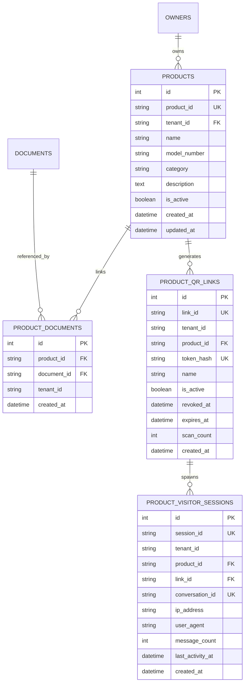

# Milestone M1A — Product QR Implementation Audit & Architecture

**Milestone:** M1A (Product QR Internal Web Demo Foundation)  
**Status:** IMPLEMENTATION PHASE  
**Date:** September 2026  
**Scope:** Browser-based Text and WebRTC Voice for Product Support QR  

---

## 1. Executive Summary & Objective

The objective of Milestone M1A is to establish the minimum verified technical foundation for Scribe's **Product QR** wedge:
1. Allow brand owners to create products (e.g. appliances, hardware), assign uploaded technical documentation (manuals, error guides), and generate shareable/printable QR links (`/p/{token}`).
2. Allow end-user consumers scanning `/p/{token}` to open an isolated browser session without requiring authentication or account creation.
3. Allow consumers to ask text questions and receive answers strictly grounded in the assigned product documentation.
4. Enforce strict safety guardrails: refuse unsafe repair/maintenance instructions (electrical enclosures, bypassing safety cutoffs, gas lines, high voltage) and escalate to authorized brand technicians.
5. Provide WebRTC voice escalation using the existing local voice worker foundation, with fast-fail HTTP 503 error handling if the worker is unavailable.
6. Protect existing workspace functionality: zero changes to `/t/[token]` business contact links, zero modifications to Docker infrastructure/ports, zero exposure of secrets, and strict feature gating behind `PRODUCT_QR_ENABLED=false` by default.

---

## 2. Reusable Existing Architecture & Components

The current repository already provides robust foundational components that will be directly reused without reinvention:

| Subsystem | Existing File | Reusable Functionality | Product QR Adaptation |
| :--- | :--- | :--- | :--- |
| **Configuration** | `backend/app/config.py` | `Settings` via `pydantic-settings`, DB and service URLs, LiveKit secrets | Add `PRODUCT_QR_ENABLED: bool = False`. |
| **Database Engine** | `backend/app/database.py` | Async SQLAlchemy engine (`create_async_engine`), `Base.metadata.create_all`, `_ADDED_INDEXES` | Add new declarative models to `db_models.py`; append composite query indexes to `_ADDED_INDEXES`. |
| **Existing Models** | `backend/app/models/db_models.py` | `DocumentRecord`, `ConversationRecord`, `MessageRecord` | Reused for document storage and message persistence. New product-specific tables reference `DocumentRecord.document_id`. |
| **Session Security** | `backend/app/session.py` | HMAC-SHA256 token issue/verify, base64 urlsafe encoding, cookie flags | Model dedicated `product_session` cookie for visitor isolation. |
| **Identity & Auth** | `backend/app/identity.py` | `Identity`, `get_identity`, `_require_owner` | Owner product management uses `_require_owner(identity)`. Public visitor routes use dedicated visitor session resolution. |
| **Vector RAG** | `backend/app/rag/rag_pipeline.py` & `backend/app/api/routes.py` | Qdrant vector retrieval, cosine similarity, LLM prompt construction | RAG pipeline retrieval scoped strictly to document IDs assigned to the specific product. |
| **Voice Supervisor** | `backend/app/services/voice/worker_supervisor.py` & `voice_routes.py` | `ensure_worker_running()`, `is_worker_available()`, LiveKit token minting | Check voice worker health; return HTTP 503 if offline. Inject product identity & prompt into LiveKit room metadata. |
| **Owner UI** | `frontend/app/components/owner/OwnerShell.tsx` | Responsive navigation shell, theme styling | Add "Products" navigation item linking to `/products`. |

---

## 3. Risks, Boundaries & Architectural Pitfalls

### 3.1 Device Binding Pitfall (CRITICAL)
- **Hazard:** The existing `/t/[token]` contact system binds the first visitor device ID (`Contact.bound_device`) to prevent link forwarding for private contacts.
- **Rule:** **DO NOT** reuse or adapt `Contact.bound_device` for Product QR visitors. Product QRs are printed on physical packaging, user manuals, and appliance labels. Thousands of distinct consumers will scan the exact same QR code. Binding a device to a product QR link would lock out every customer after the first scan.
- **Solution:** `ProductQrLinkRecord` represents the shared link. Each scan generates or associates a distinct `ProductVisitorSessionRecord` identified by a cryptographically signed `product_session` cookie (`product_session:<session_id>:<tenant_id>:<product_id>`), completely decoupling link identity from visitor sessions.

### 3.2 Document Scoping & Cross-Tenant Data Leaks (CRITICAL)
- **Hazard:** If a visitor chat request passes `document_ids` in the request body, a malicious client could query internal documents from other products or workspaces.
- **Rule:** The public chat endpoint must **NEVER** trust client-supplied document IDs. Document IDs are resolved strictly server-side by querying `ProductDocumentRecord` where `product_id == session.product_id` and `tenant_id == session.tenant_id`.
- **Abstention Guarantee:** If no documents are linked to the product, or if Qdrant returns no chunks above the similarity threshold, the server must abstain with the exact phrasing:
  > *"I couldn't find that information in this product's official support material. Please contact the brand's support team."*

### 3.3 Safety & Liability Guardrails (CRITICAL)
- **Hazard:** Hardware appliances (microwaves, water purifiers, water heaters, EV chargers, solar inverters) carry life-safety risks (electrocution, refrigerant leaks, fire, explosion). An LLM hallucinating DIY repair steps on high-voltage components creates catastrophic physical liability.
- **Rule:** Implement a deterministic, pre-generation safety classifier in `backend/app/services/product_safety.py`. If a user asks about:
  - Opening high-voltage electrical enclosures or capacitor terminals;
  - Bypassing thermal cutoffs, limit switches, or safety fuses;
  - Modifying internal wiring or grounding pins;
  - Gas leaks, refrigerant lines, or pressurized vessels;
  - Disassembling sealed motor housings or magnetrons;
  The system must immediately halt generation and return a conservative safety warning:
  > *"Safety Warning: Servicing internal electrical, gas, or high-voltage components poses serious safety risks and may void your warranty. Please disconnect power/fuel immediately and contact an authorized service technician for assistance."*

### 3.4 Operational & Infrastructure Invariance
- Do **NOT** modify Docker configurations, Compose files, or container ports. Docker runs only PostgreSQL (5432), Redis (6379), Qdrant (6333), and LiveKit (7880).
- Do **NOT** read, modify, or log `backend/.env`. All configuration reads must flow through `backend/app/config.py`.
- Keep feature flag `PRODUCT_QR_ENABLED: bool = False` by default.

---

## 4. Database Schema Design (Phase 2)

Four new declarative tables added to `backend/app/models/db_models.py`:

### Table Definitions:
1. `products`:
   - `id`: `Integer`, primary key, autoincrement.
   - `product_id`: `String(36)`, unique, index, UUID.
   - `tenant_id`: `String(128)`, index.
   - `name`: `String(200)`.
   - `model_number`: `String(100)`.
   - `category`: `String(64)`, nullable.
   - `description`: `Text`, nullable.
   - `is_active`: `Boolean`, default True.
   - `created_at`: `DateTime(timezone=True)`, default `_utcnow`.
   - `updated_at`: `DateTime(timezone=True)`, default `_utcnow`.

2. `product_documents`:
   - `id`: `Integer`, primary key, autoincrement.
   - `product_id`: `String(36)`, ForeignKey("products.product_id"), index.
   - `document_id`: `String(36)`, ForeignKey("documents.document_id"), index.
   - `tenant_id`: `String(128)`, index.
   - `created_at`: `DateTime(timezone=True)`, default `_utcnow`.
   - UniqueConstraint on `(product_id, document_id)`.

3. `product_qr_links`:
   - `id`: `Integer`, primary key, autoincrement.
   - `link_id`: `String(36)`, unique, index.
   - `tenant_id`: `String(128)`, index.
   - `product_id`: `String(36)`, ForeignKey("products.product_id"), index.
   - `token_hash`: `String(64)`, unique, index (SHA-256 hex digest of plaintext token).
   - `name`: `String(200)` (e.g., "Box Packaging Batch 1").
   - `is_active`: `Boolean`, default True.
   - `revoked_at`: `DateTime(timezone=True)`, nullable.
   - `expires_at`: `DateTime(timezone=True)`, nullable.
   - `scan_count`: `Integer`, default 0.
   - `created_at`: `DateTime(timezone=True)`, default `_utcnow`.

4. `product_visitor_sessions`:
   - `id`: `Integer`, primary key, autoincrement.
   - `session_id`: `String(36)`, unique, index.
   - `tenant_id`: `String(128)`, index.
   - `product_id`: `String(36)`, ForeignKey("products.product_id"), index.
   - `link_id`: `String(36)`, ForeignKey("product_qr_links.link_id"), index.
   - `conversation_id`: `String(36)`, unique, index.
   - `ip_address`: `String(64)`, nullable.
   - `user_agent`: `String(300)`, nullable.
   - `message_count`: `Integer`, default 0.
   - `last_activity_at`: `DateTime(timezone=True)`, default `_utcnow`.
   - `created_at`: `DateTime(timezone=True)`, default `_utcnow`.

---

## 5. API Endpoint Contracts

### 5.1 Owner APIs (`/api/v1/product-qr/...`)
Protected by owner authentication (`_require_owner(identity)`) and feature flag `PRODUCT_QR_ENABLED`:

| Method | Path | Request Body | Response Body |
| :--- | :--- | :--- | :--- |
| `POST` | `/api/v1/product-qr/products` | `{ name, model_number, category?, description? }` | `{ product_id, name, model_number, category, description, is_active, created_at }` |
| `GET` | `/api/v1/product-qr/products` | None | `{ products: [...] }` |
| `GET` | `/api/v1/product-qr/products/{id}` | None | `{ product, documents: [...], links: [...] }` |
| `PATCH` | `/api/v1/product-qr/products/{id}` | `{ name?, model_number?, category?, description?, is_active? }` | `{ product }` |
| `POST` | `/api/v1/product-qr/products/{id}/documents` | `{ document_id }` | `{ success: true, product_id, document_id }` |
| `DELETE` | `/api/v1/product-qr/products/{id}/documents/{doc_id}` | None | `{ success: true }` |
| `GET` | `/api/v1/product-qr/products/{id}/documents` | None | `{ documents: [...] }` |
| `POST` | `/api/v1/product-qr/products/{id}/links` | `{ name?, expires_in_days? }` | `{ link_id, name, token, url, created_at }` *(token returned only once)* |
| `GET` | `/api/v1/product-qr/products/{id}/links` | None | `{ links: [...] }` *(token_hash omitted)* |
| `POST` | `/api/v1/product-qr/links/{link_id}/revoke` | None | `{ success: true, revoked_at }` |

### 5.2 Public Visitor APIs (`/api/v1/product-qr/public/...`)
Accessible by consumers; rate-limited and feature-flagged:

| Method | Path | Auth / Headers | Request Body | Response Body |
| :--- | :--- | :--- | :--- | :--- |
| `POST` | `/api/v1/product-qr/public/{token}/open` | None (Client IP rate limit) | None | `{ product: { name, model_number, category, description }, session_id, conversation_id }` + Sets `product_session` cookie |
| `POST` | `/api/v1/product-qr/public/chat` | `product_session` cookie | `{ message, conversation_id? }` | `{ reply, citations: [...], is_safety_escalation: bool }` |
| `POST` | `/api/v1/product-qr/public/voice/token` | `product_session` cookie | None | `{ token, url, room_name }` (or HTTP 503 if worker unavailable) |

---

## 6. Files to Create and Modify

### New Files:
1. `validation/product_qr/M1A_IMPLEMENTATION_AUDIT.md` (This document)
2. `backend/app/services/product_safety.py` (Rule-based hazardous repair detection & escalation text)
3. `backend/app/repositories/product_qr.py` (Async DB repository queries for products, links, and sessions)
4. `backend/app/api/product_qr_owner_routes.py` (Owner product & link management endpoints)
5. `backend/app/api/product_qr_public_routes.py` (Public token open, scoped chat, and voice token endpoints)
6. `backend/tests/test_product_qr.py` (Integration and unit test suite)
7. `frontend/app/products/page.tsx` (Owner product catalog page)
8. `frontend/app/products/[productId]/page.tsx` (Owner product detail, documents, and QR link generator page)
9. `frontend/app/p/[token]/page.tsx` (Public consumer responsive troubleshooting & voice interface)

### Modified Files:
1. `backend/app/config.py` (Add `PRODUCT_QR_ENABLED: bool = False`)
2. `backend/app/models/db_models.py` (Register the 4 new SQLAlchemy models)
3. `backend/app/database.py` (Register composite indexes for product lookups in `_ADDED_INDEXES`)
4. `backend/app/main.py` (Mount the new routers conditionally when `settings.PRODUCT_QR_ENABLED` is active)
5. `frontend/app/components/owner/OwnerShell.tsx` (Add Products nav link in owner sidebar)

---

## 7. Rollback & Isolation Plan

1. **Feature Flag Kill Switch:**  
   If `PRODUCT_QR_ENABLED=false` (default), all `/api/v1/product-qr/*` endpoints return HTTP 404. Public routes `/p/[token]` render a graceful "Feature Not Enabled" message. Existing `/t/[token]` business contact links remain 100% operational.
2. **Schema Isolation:**  
   All new tables (`products`, `product_documents`, `product_qr_links`, `product_visitor_sessions`) are strictly additive. No existing columns are altered. Rolling back simply requires setting `PRODUCT_QR_ENABLED=false` or dropping the 4 new tables.
3. **Zero Secret Footprint:**  
   Tokens are stored strictly as SHA-256 hashes (`token_hash`). Plaintext tokens are returned exactly once upon link creation.
